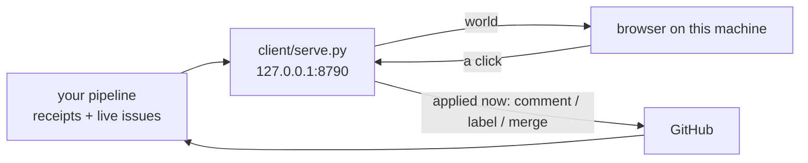

# nexus-office

**A room you can walk into, containing everything your agents are working on.**

One villager per repo, one desk per villager, one wing per GitHub owner. What a
character is doing with its body is that repo's real state, and clicking a desk
opens its issues inline with buttons that do something. It runs on your own
machine, and a click is applied the moment you make it.

Built for [issue-to-PR pipelines](#what-feeds-it): the kind of automation that
files issues, works them, opens PRs, and periodically gets stuck and needs a
person. Those pipelines are invisible by nature. This makes them a place.



## The security model, in three sentences

The server binds loopback only, never `0.0.0.0`, so the door is the machine:
nobody else can reach the port at all, and reaching it from a phone goes through
Tailscale Serve in front of it rather than a wider bind. Everything that touches
GitHub still happens in `client/office-sync.py`, which re-derives every intent
from its own fields and re-probes push access before acting. The one thing still
checked in software is the gate: a permission answer carries the id of the
question it is answering, and is refused if the agent has moved on.

## See it without setting anything up

Append `?demo=1` and the room runs on a fabricated floor: no account, no session,
no pipeline. Twelve desks across three owners, and every state below appears at
least once, because a demo that only shows the happy path lets the ugly cases rot.

```sh
npm install && npm run build && python3 client/serve.py
# then open http://127.0.0.1:8790/?demo=1
```

## Reading the room

| villager | means |
| --- | --- |
| standing, wide eyes, red `?` | your bot spoke last, so it is waiting on a human |
| standing, orange `!` | the runner refused this one |
| typing, blue screen | working, issues open |
| arms up, green screen | landed a PR in the last day |
| slumped, eyes shut, `z` | parked by its own config |
| empty chair | no account you hold a token for can push here |
| **hand up, amber `!`** | **an agent is blocked on a permission gate and a clock is running** |

"Waiting on you" is not a label lookup. It is recomputed from the comments:
**did the bot have the last word?** That is also why answering re-queues the
issue automatically, since a reply without the bot's marker is exactly what makes
a marker-based runner pick it up again. The dashboard and the runner cannot
disagree, because they are running the same sentence.

## The raised hand

The highest-value thing in here. When an agent hits a permission gate it stops
and waits for a person. Normally that is a line in a log nobody is watching, or a
prompt in a terminal that is not on screen: work silently stops and you find out
later.

In the room that agent **stands up and puts its hand up.** You see it from across
the floor, or from a phone. Tap it, read the literal command it wants to run, and
answer allow once, allow always, or deny.

Three properties this has to hold, and does:

- **The target is shown verbatim.** Never summarised, never truncated into
  ambiguity. A gate you approve without reading the command is a rubber stamp.
- **The answer carries the question's id.** Between seeing a gate and answering
  it, the agent can time out and a *different* gate can open. Answering by
  position rather than by id would approve a command nobody ever saw, so a
  mismatched answer is refused out loud.
- **A gate is never hidden.** No filter, no "put this away", nothing removes a
  raised hand from the room.

The gate is read from a **file** rather than an API, so a blocked agent is visible
whether or not the runtime's dashboard happens to be running. And while a gate is
open the sync client polls fast instead of on its usual minutes-long cycle,
because against a gate that fails closed the poll interval *is* the answer window.

## Setup

You need Node, Python 3, and the GitHub CLI logged in. Nothing else, and no
account anywhere.

```sh
git clone https://github.com/YOUR-NAME/nexus-office && cd nexus-office
npm install && npm run build

export OFFICE_OWNERS=your-github-username,your-org
python3 client/serve.py                  # then open http://127.0.0.1:8790/
python3 client/serve.py --once           # one snapshot as JSON, for a script
```

The snapshot rebuilds in the background at most once a minute, so the page never
waits on GitHub. Leave the server running (a launchd job works) and the room
stays live.

## What feeds it

With `OFFICE_OWNERS` set, every repo you can push to gets a desk and the office
works standalone.

If you already run a pipeline, point `OFFICE_RECEIPTS` at a JSONL of what it did
and the desks become a record of real work instead of a repo list:

```json
{"at":"2026-08-25T23:14:38Z","repo":"owner/name","issue":"42","outcome":"landed","detail":"opened a PR"}
```

`outcome` is free text. `landed`, `refused` and `parked` drive the villagers;
anything describing a run rather than a repo (`survey`, `deferred`, `dry-run`,
`caught-up`) is skipped when picking a desk's headline.

Full configuration is documented at the top of `client/office-sync.py`.

## Building on it

```
client/serve.py      the whole API, on this machine. Loopback only.
src/scene/office.js  the room: layout, furniture, camera, picking
src/scene/villager.js one character, and the state to body mapping
src/scene/kit.js     shared art supplies: toon materials, faces, sprites
src/ui/panel.js      the inline issue viewer and every button that acts
client/office-sync.py the only thing that holds credentials
client/runtime.py    the local agent runtime adapter: gates, runs, cost
```

`window.office` is exposed in the browser on purpose. A 3D surface that can only
be inspected by squinting at screenshots is a surface nobody can debug.

Three.js, Vite, and the Python standard library. No framework, no CDN, no
service to sign up for. The whole front end is about 1,500 lines.

## Where this is going

[`docs/architecture.md`](docs/architecture.md) is the map, and
[issue #16](https://github.com/ariaxhan/nexus-office/issues/16) is the index.

The short version: the office is a face for machinery that already runs and is
currently invisible. It adapts an issue pipeline, a local agent runtime, a memory
store and a scheduler rather than building any of them, and every feature has to
survive a server with no login in front of it.

## License

MIT.
