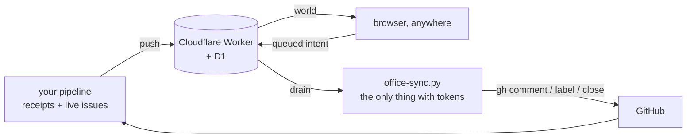

# nexus-office

**A room you can walk into, containing everything your agents are working on.**

One villager per repo, one desk per villager, one wing per GitHub owner. What a
character is doing with its body is that repo's real state, and clicking a desk
opens its issues inline with buttons that do something. It runs on Cloudflare and
opens on a phone.

Built for [issue-to-PR pipelines](#what-feeds-it): the kind of automation that
files issues, works them, opens PRs, and periodically gets stuck and needs a
person. Those pipelines are invisible by nature. This makes them a place.



## The security model, in one paragraph

The Worker holds no GitHub credentials and never will. It stores a snapshot and a
queue of intents. Everything that touches GitHub happens on your machine, in
`client/office-sync.py`, which re-derives every intent from its own fields and
re-probes push access before acting. Someone who steals a browser session can
**queue** an intent and never **execute** one.

| secret | lives in | can |
| --- | --- | --- |
| your password | Worker secret + your keychain | open the office in a browser |
| `VIEW_TOKEN` | Worker secret, issued to browsers on login | read the world, queue an intent |
| `PUSH_TOKEN` | your keychain only, never sent to a browser | drain the queue, replace the snapshot |

Failed logins are rate limited per IP. Nothing is stored in the repo, and
`wrangler.jsonc` (which carries your database id) is gitignored by design.

## See it without setting anything up

Append `?demo=1` and the room runs on a fabricated floor: no account, no session,
no pipeline. Twelve desks across three owners, and every state below appears at
least once, because a demo that only shows the happy path lets the ugly cases rot.

```sh
npm install && npm run dev
# then open http://127.0.0.1:5173/?demo=1
```

## Reading the room

| villager | means |
| --- | --- |
| standing, wide eyes, red `?` | your bot spoke last, so it is waiting on a human |
| standing, orange `!` | the runner refused this one |
| typing, blue screen | working, issues open |
| arms up, green screen | landed a PR in the last day |
| slumped, eyes shut, `z` | parked by its own config |
| empty chair | no account you hold a token for can push here |

"Waiting on you" is not a label lookup. It is recomputed from the comments:
**did the bot have the last word?** That is also why answering re-queues the
issue automatically, since a reply without the bot's marker is exactly what makes
a marker-based runner pick it up again. The dashboard and the runner cannot
disagree, because they are running the same sentence.

## Setup

You need Node, a Cloudflare account, and the GitHub CLI logged in.

```sh
git clone https://github.com/YOUR-NAME/nexus-office && cd nexus-office
npx wrangler login
./scripts/setup.sh
```

That creates the D1 database, writes `wrangler.jsonc`, applies the schema, mints
the tokens, asks for a password, builds, and deploys. Then feed it:

```sh
export OFFICE_URL=https://nexus-office.YOUR-SUBDOMAIN.workers.dev
export OFFICE_OWNERS=your-github-username,your-org

python3 client/office-sync.py --push     # build a snapshot, send it up
python3 client/office-sync.py --check    # prove the whole surface, live
python3 client/office-sync.py --open     # open it in a browser
```

Put `python3 client/office-sync.py` on a schedule and the room stays live. Two
jobs works well: `--drain` every couple of minutes (cheap, one HTTP GET unless
somebody clicked something) and `--push` every ten (it lists issues, so it is
not free).

## What feeds it

With `OFFICE_OWNERS` set, every repo you can push to gets a desk and the office
works standalone.

If you already run a pipeline, point `OFFICE_RECEIPTS` at a JSONL of what it did
and the desks become a record of real work instead of a repo list:

```json
{"at":"2026-08-25T23:14:38Z","repo":"owner/name","issue":"42","outcome":"landed","detail":"opened a PR"}
```

`outcome` is free text. `landed`, `refused` and `parked` drive the villagers;
anything describing a run rather than a repo (`survey`, `deferred`, `dry-run`,
`caught-up`) is skipped when picking a desk's headline.

Full configuration is documented at the top of `client/office-sync.py`.

## Building on it

```
worker/index.js      the whole API. Two tables, no credentials, ~200 lines.
src/scene/office.js  the room: layout, furniture, camera, picking
src/scene/villager.js one character, and the state to body mapping
src/scene/kit.js     shared art supplies: toon materials, faces, sprites
src/ui/panel.js      the inline issue viewer and every button that acts
client/office-sync.py the only thing that holds credentials
```

`window.office` is exposed in the browser on purpose. A 3D surface that can only
be inspected by squinting at screenshots is a surface nobody can debug.

Three.js, Vite, a Cloudflare Worker, and D1. No framework, no CDN, no build step
you have to understand. The whole front end is about 1,500 lines.

## Where this is going

[`docs/architecture.md`](docs/architecture.md) is the map, and
[issue #16](https://github.com/ariaxhan/nexus-office/issues/16) is the index.

The short version: the office is a face for machinery that already runs and is
currently invisible. It adapts an issue pipeline, a local agent runtime, a memory
store and a scheduler rather than building any of them, and every feature has to
survive a Worker that holds no credentials.

## License

MIT.
