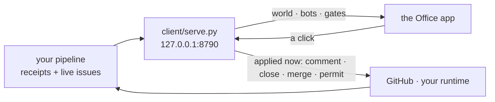

# nexus-office

**A Mac app for the agents that are already running without you watching.**

A roster on the left: your bots first, then one row per repo you can push to. A
thread on the right. You message a bot like a colleague, and you open a desk to
read that repo's issues with buttons that act. It runs on your own machine, and a
click is applied the moment you make it.

It looks like a chat app on purpose, and it is not one. It is the face of two
things that already run on this machine without a screen: an
[issue-to-PR pipeline](#what-feeds-it) that files issues, works them and opens
PRs, and an agent runtime (the harness) that runs bots on a schedule and stops
at permission gates. Both are invisible by nature. This gives them a face.

## Three words, for a stranger

| word | what it is |
|---|---|
| **desk** | one row per repo you can push to. Open it and you get that repo's live issues and PRs with buttons that comment, close and merge for real, applied the moment you click. Desks are a pure function of the repos you own, never a hand-kept list. |
| **gate** | an agent stopped on a permission question. It is a file with an id on this machine. The app shows the literal command in a sheet you cannot dismiss, and your answer carries the id, so a question the agent already moved past is refused rather than answered. A gate is never hidden. |
| **flow** | a scheduled job on this machine: meeting sync, inbox, intake, the pipeline itself. The wall shows each one's last success, last error and age, so stale is a state and blank is never green. |

A bot in the roster is a person-shaped handle on the harness: one conversation
history each, and its runs, commissions and gates appear inline as it works.



## The raised hand

The highest-value thing in here. When an agent hits a permission gate it stops
and waits for a person. Normally that is a line in a log nobody is watching, or a
prompt in a terminal that is not on screen: work silently stops and you find out
later.

Here it is a message in that bot's thread, a **sheet you cannot dismiss without
answering**, an OS notification, and an amber menu-bar dot that stays amber with
the window closed. Read the literal command, then answer allow once, allow
always, or deny. Three properties this has to hold, and does:

- **The target is shown verbatim.** Never summarised, never truncated into
  ambiguity. A gate you approve without reading the command is a rubber stamp.
- **The answer carries the question's id.** Between seeing a gate and answering
  it, the agent can time out and a *different* gate can open. Answering by
  position rather than by id would approve a command nobody ever saw, so a
  mismatched answer is refused out loud.
- **A gate is never hidden.** No filter, no "put this away", nothing removes a
  raised hand. It is read from a **file** rather than an API, so a blocked agent
  is visible whether or not the runtime's own dashboard is running.

## The security model, in three sentences

The door binds loopback only, never `0.0.0.0`, so the machine *is* the perimeter:
nobody else can reach the port at all, and a phone reaching it goes through
Tailscale Serve in front rather than a wider bind, carrying Aria's login. Every write must name
that door as its `Host`, arrive as `application/json`, and carry either this
origin or no origin at all, because a page you have open elsewhere can post to
`127.0.0.1` without a preflight. Everything that touches GitHub happens in
`client/office-sync.py`, and a permission answer carries the id of the question
it is answering, so it is refused if the agent has moved on.

## See it without setting anything up

The app takes a fixture instead of the network: no account, no session, no
pipeline. Every desk state appears in it at least once, because a demo that only
shows the happy path lets the ugly cases rot.

```sh
brew install xcodegen
cd app && xcodegen generate && open Office.xcodeproj   # then Run
./scripts/shoot.sh                                     # or: build it and photograph it
```

`--demo app/Demo/demo.json` is what puts the real views on the fake floor.

## Run it for real

You need Xcode, Python 3, and the GitHub CLI logged in. No account anywhere.

```sh
export OFFICE_OWNERS=your-github-username,your-org
export OFFICE_POLL_S=300         # how often the door asks GitHub (default 300)
export OFFICE_GH_RESERVE=1000    # pause GitHub fetches under this many points left
python3 client/serve.py --root ~/path/to/your/vault    # the door, and the runtime root
python3 client/serve.py --once                         # one snapshot as JSON, for a script
```

Then open the app. `--root` is where the agent runtime keeps its gates, runs and
cost, and where `_meta/bots.json` names your bots. The snapshot rebuilds in the
background at most once a minute, so nothing waits on GitHub. Leave the door
running (a launchd job works) and the roster stays live.

GitHub can knock, so the room does not have to keep asking. Set
`OFFICE_WEBHOOK_SECRET` and `POST /webhook` becomes the one path Tailscale
Funnel puts on the public internet, on its own port:

```sh
export OFFICE_WEBHOOK_SECRET="$(security find-generic-password -s github-webhook -a secret -w)"
tailscale funnel --bg --https=8443 --set-path=/webhook http://127.0.0.1:8790/webhook
```

Funnel is per PORT, not per path, so it gets 8443 with exactly one mount and
every other path there 404s. Add `your-host.ts.net:8443` to
`OFFICE_TRUSTED_HOSTS`. That route is the only one exempt from the tailnet login
and the origin rule, because GitHub can satisfy neither; what holds it up is an
HMAC-SHA256 over the raw request bytes, and with no secret set it answers 503
rather than accepting anything unsigned. A comment, an issue or a merged PR
debounces for twenty seconds and then runs `dispatch.sh --repo` for that one
checkout, serially, because the pipeline takes one global lock. The pipeline's
own comments never trigger it. `GET /api/webhook` says whether anything is
arriving. `scripts/register-webhooks.sh <hook-url>` registers one hook per repo
(there is no user-level webhook), reading the repo list off the door rather than
off a list anybody maintains.

Both halves have to be on, and the office now says which one is not: when nothing
has ever arrived it asks Tailscale whether there is a public mount at all, and a
door with no Funnel in front of it reads `unreachable` with the reason on the
card, never as a quiet Sunday. `docs/webhooks.md` has the two steps, one of which
is a click in the Tailscale admin console that nothing on this machine can do for
you.

The same door serves the phone at `/`: three files out of `client/phone/`, no
build step and no request to anywhere but itself, showing the raised hand first,
then what needs you, the bots, the desks and the wall. It is the same office and
the same writes, so answering a gate from a pocket is answering it. Put it on the
tailnet with `tailscale serve --bg 8790`, then name the tailnet host in
`OFFICE_TRUSTED_HOSTS` and yourself in `OFFICE_LOGIN`: off loopback the request
must carry the `Tailscale-User-Login` that matches, or it is 403 before it reads
a thing. That check is why the page has nothing to log in to.

## The automation, and the agents already running

Two questions the office used to answer only in a terminal.

**What is the automation doing?** The `automation` row at the top of the wall
opens a page that says it in one screen: when the runner next looks and when it
last finished a whole sweep, whether it is running right now, whether anything on
the internet can reach the webhook door, and then the list that matters, which is
every issue it touched with a link to the comment it left. That link is the exact
comment while the runner still has the last word; once a human replies it becomes
a link to the thread instead, because a deep link to somebody else's words wearing
the pipeline's label is worse than no deep link. The whole page is assembled
server side in `client/automation.py` out of numbers the snapshot already
carried, so the Mac app and the phone say one sentence about one machine.

**What is running in this folder?** Every desk now shows the Claude Code and
Codex sessions sitting in its checkout, what each one is doing, and a box to
answer the one that is waiting on you. `start claude` and `start codex` launch a
background session in that folder, so the phone request returns while the agent
keeps running. It reads `hcom`, which is the only thing on this machine
that knows both which sessions are alive and how to reach one, so a session that
never ran `hcom start` is invisible here and the office says so rather than
drawing an empty list, which would be a claim that nothing is running.

A reply is a message, never a keystroke: it lands in the agent's queue and it
reads it at its next hook. Nothing in this project injects into a live terminal,
because a message arriving mid-prompt is submitted into whatever was half typed
there. A message addressed to a session `hcom` calls inactive is refused rather
than sent, since a "sent" over a message nothing will ever read is exactly the
false green this project exists to kill.

## Verify gates

```sh
npm test        # the python door + the Swift state rules, headless
npm run shot    # builds the app, photographs twelve framings, then LOOK
```

`scripts/shoot.sh` writes twelve PNGs into `shots/`: `app-roster.png` (bots above
desks), `app-desk.png` (a desk thread), `app-gate.png` (the sheet over the room),
`app-needs.png` (the "needs me" filter), `app-wall.png` (the local sources, and
the one that says something needs a person), `app-putaway.png` (the desks a
person put away, and a desk saying out loud that what you are reading is the last
thing it managed to pull) and `app-attach.png` (a picture picked and not yet
sent: the chip, its size after the downscale, and the mark on the turn above it
that already carried one), `app-automation.png` (the automation page: the
schedule, the door, and what the runner touched with a link to what it said) and
`app-sessions.png` (a desk with a live agent on it, its conversation open and a
reply half typed) and `app-reactions.png` (a conversation with marks on two of
its turns: the one surface drawn from a store no other framing reads) and
`app-readme.png` (a desk with nothing open on it, drawing the repo's own front
page instead of one grey line). The twelfth, `app-light.png`, is the roster with the
lights on: the office follows the system appearance, and it comes from a second
run because there is no way to be in two appearances at once. They are not committed, because a screenshot in a repo is
stale the day after it lands. Run it and open them: every defect this project has
had was invisible in source and obvious on screen.

## What feeds it

With `OFFICE_OWNERS` set, every repo you can push to gets a desk and the office
works standalone.

If you already run a pipeline, point `OFFICE_RECEIPTS` at a JSONL of what it did
and those desks become a record of real work; `OFFICE_OWNERS` still adds the
repos the pipeline never reached. A repo moved to another org is one desk under
its current name, however old the receipts calling it by the old one:

```json
{"at":"2026-08-25T23:14:38Z","repo":"owner/name","issue":"42","outcome":"landed","detail":"opened a PR"}
```

`outcome` is free text. `landed`, `refused` and `parked` drive the desk states;
anything describing a run rather than a repo (`survey`, `deferred`, `dry-run`) is
skipped when picking a desk's headline. Full configuration is documented at the
top of `client/office-sync.py`.

## The map, and the licence

[`docs/architecture.md`](docs/architecture.md) is where this is going;
[issue #16](https://github.com/ariaxhan/nexus-office/issues/16) is the index.
MIT licensed.
