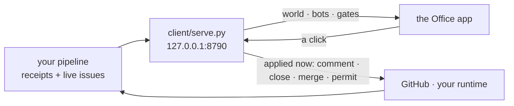

# nexus-office

**A Mac app for the agents that are already running without you watching.**

A roster on the left: your bots first, then one row per repo you can push to. A
thread on the right. You message a bot like a colleague, and you open a desk to
read that repo's issues with buttons that act. It runs on your own machine, and a
click is applied the moment you make it.

It looks like a chat app on purpose, and it is not one. It is the face of two
things that already run on this machine without a screen: an
[issue-to-PR pipeline](#what-feeds-it) that files issues, works them and opens
PRs, and an agent runtime (the harness) that runs bots on a schedule and stops
at permission gates. Both are invisible by nature. This gives them a face.

## Three words, for a stranger

| word | what it is |
|---|---|
| **desk** | one row per repo you can push to. Open it and you get that repo's live issues and PRs with buttons that comment, close and merge for real, applied the moment you click. Desks are a pure function of the repos you own, never a hand-kept list. |
| **gate** | an agent stopped on a permission question. It is a file with an id on this machine. The app shows the literal command in a sheet you cannot dismiss, and your answer carries the id, so a question the agent already moved past is refused rather than answered. A gate is never hidden. |
| **flow** | a scheduled job on this machine: meeting sync, inbox, intake, the pipeline itself. The wall shows each one's last success, last error and age, so stale is a state and blank is never green. |

A bot in the roster is a person-shaped handle on the harness: one conversation
history each, and its runs, commissions and gates appear inline as it works.



## The raised hand

The highest-value thing in here. When an agent hits a permission gate it stops
and waits for a person. Normally that is a line in a log nobody is watching, or a
prompt in a terminal that is not on screen: work silently stops and you find out
later.

Here it is a message in that bot's thread, a **sheet you cannot dismiss without
answering**, an OS notification, and an amber menu-bar dot that stays amber with
the window closed. Read the literal command, then answer allow once, allow
always, or deny. Three properties this has to hold, and does:

- **The target is shown verbatim.** Never summarised, never truncated into
  ambiguity. A gate you approve without reading the command is a rubber stamp.
- **The answer carries the question's id.** Between seeing a gate and answering
  it, the agent can time out and a *different* gate can open. Answering by
  position rather than by id would approve a command nobody ever saw, so a
  mismatched answer is refused out loud.
- **A gate is never hidden.** No filter, no "put this away", nothing removes a
  raised hand. It is read from a **file** rather than an API, so a blocked agent
  is visible whether or not the runtime's own dashboard is running.

## The security model, in three sentences

The door binds loopback only, never `0.0.0.0`, so the machine *is* the perimeter:
nobody else can reach the port at all, and a phone reaching it (milestone 2) goes
through Tailscale Serve in front rather than a wider bind. Every write must name
that door as its `Host`, arrive as `application/json`, and carry either this
origin or no origin at all, because a page you have open elsewhere can post to
`127.0.0.1` without a preflight. Everything that touches GitHub happens in
`client/office-sync.py`, and a permission answer carries the id of the question
it is answering, so it is refused if the agent has moved on.

## See it without setting anything up

The app takes a fixture instead of the network: no account, no session, no
pipeline. Every desk state appears in it at least once, because a demo that only
shows the happy path lets the ugly cases rot.

```sh
brew install xcodegen
cd app && xcodegen generate && open Office.xcodeproj   # then Run
./scripts/shoot.sh                                     # or: build it and photograph it
```

`--demo app/Demo/demo.json` is what puts the real views on the fake floor.

## Run it for real

You need Xcode, Python 3, and the GitHub CLI logged in. No account anywhere.

```sh
export OFFICE_OWNERS=your-github-username,your-org
export OFFICE_POLL_S=300         # how often the door asks GitHub (default 300)
export OFFICE_GH_RESERVE=1000    # pause GitHub fetches under this many points left
python3 client/serve.py --root ~/path/to/your/vault    # the door, and the runtime root
python3 client/serve.py --once                         # one snapshot as JSON, for a script
```

Then open the app. `--root` is where the agent runtime keeps its gates, runs and
cost, and where `_meta/bots.json` names your bots. The snapshot rebuilds in the
background at most once a minute, so nothing waits on GitHub. Leave the door
running (a launchd job works) and the roster stays live.

## Verify gates

```sh
npm test        # the python door + the Swift state rules, headless
npm run shot    # builds the app, photographs six framings, then LOOK
```

`scripts/shoot.sh` writes six PNGs into `shots/`: `app-roster.png` (bots above
desks), `app-desk.png` (a desk thread), `app-gate.png` (the sheet over the room),
`app-needs.png` (the "needs me" filter), `app-wall.png` (the local sources, and
the one that says something needs a person) and `app-putaway.png` (the desks a
person put away, and a desk saying out loud that what you are reading is the last
thing it managed to pull). They are not committed, because a screenshot in a repo is
stale the day after it lands. Run it and open them: every defect this project has
had was invisible in source and obvious on screen.

## What feeds it

With `OFFICE_OWNERS` set, every repo you can push to gets a desk and the office
works standalone.

If you already run a pipeline, point `OFFICE_RECEIPTS` at a JSONL of what it did
and the desks become a record of real work instead of a repo list:

```json
{"at":"2026-08-25T23:14:38Z","repo":"owner/name","issue":"42","outcome":"landed","detail":"opened a PR"}
```

`outcome` is free text. `landed`, `refused` and `parked` drive the desk states;
anything describing a run rather than a repo (`survey`, `deferred`, `dry-run`) is
skipped when picking a desk's headline. Full configuration is documented at the
top of `client/office-sync.py`.

## The map, and the licence

[`docs/architecture.md`](docs/architecture.md) is where this is going;
[issue #16](https://github.com/ariaxhan/nexus-office/issues/16) is the index.
MIT licensed.
