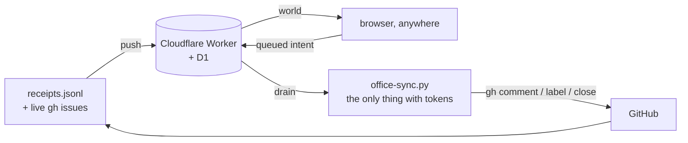

# nexus-office

A room you can walk into, containing every repo the issue pipeline works.

Live: **https://nexus-office.ariaxhan.workers.dev**

One villager per repo, one desk per villager, one wing per GitHub owner. What a
character is doing with its body is the repo's real state, and clicking one opens
its issues inline with buttons that do something.



## The security model, in one paragraph

The Worker holds no credentials and never will. It stores a snapshot and a queue
of intents. Everything that touches GitHub happens on the laptop, in
`office-sync.py`, which re-derives every intent from its own fields and re-probes
push access before acting. A stolen view token can therefore **queue** an intent
and never **execute** one.

| token | held by | can |
| --- | --- | --- |
| `view` | the browser, in localStorage | read the world, queue an intent |
| `push` | the laptop keychain only | drain the queue, replace the snapshot |

Both live in the macOS keychain under service `nexus-office`, fed to the Worker as
secrets. Neither is ever written to a file or passed as a command argument.

## Reading the room

| villager | means |
| --- | --- |
| standing, wide eyes, red `?` | the bot spoke last; it is waiting on you |
| standing, orange `!` | the runner refused this one |
| typing, blue screen | working, issues open |
| arms up, green screen, `*` | landed a PR in the last day |
| slumped, eyes shut, `z` | parked by its own config |
| empty desk | no account we hold a token for can push here |

"Waiting on you" is not a label. It is the runner's own rule, recomputed here:
**did the bot have the last word?** Answering re-queues the issue automatically,
because a comment without the marker is exactly what makes the runner pick it up.

## Running it

```sh
python3 _meta/services/office/office-sync.py            # drain, then push
python3 _meta/services/office/office-sync.py --check     # prove the live surface
python3 _meta/services/office/office-sync.py --pair      # a code for your phone
python3 _meta/services/office/office-sync.py --cancel 7  # drop a queued decision
```

Two launchd jobs keep it fed: `com.nexus.office-drain` (every 2 min) and
`com.nexus.office-push` (every 10 min). Both live in
`_meta/services/jobs/registry.jsonl`; change them there and run `jobctl sync`.

## Signing in on another device

`--pair` mints a six-character code good for ten minutes and one device. Open
`/pair/<code>` and the browser trades it for the real key, once. The long token
never has to be typed or read aloud.

## Deploying

```sh
npm run deploy                    # build + wrangler deploy
./scripts/mint-tokens.sh view     # rotate just the travelling token
```

Pinned to the personal **aria** Cloudflare account, the same isolation
`nexus-cloud` declares. Never the matra/blinkbuild account.
