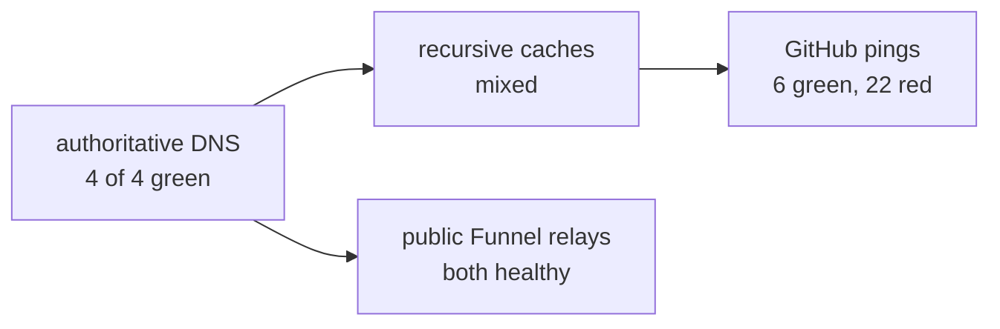

# Machine pass: the phone and data flows are live; webhooks are propagating and Mac control needs an app relaunch

⛔ **Blocked on two human edges**

**In one line:** The Mac-only checks ran. The phone door works, Granola/Gmail/Drive hold, webhook DNS is authoritative but still cached unevenly, and Computer Use cannot start until Codex is relaunched.

| Issue | Live verdict | What remains |
|---|---|---|
| #42 / #24 webhooks | Funnel is mounted, TLS is valid, all four authoritative DNS servers publish both relay IPs, and GitHub accepted 6 of 28 serial pings | Let stale recursive DNS caches expire, then re-ping the 22 red hooks |
| #22 phone | HTTPS returns 200, Aria is allowed, Tim and a missing identity get 403, and `iphone171` is online | Answer one real gate from the phone; the gate is currently clear |
| #34 flow pulse | 7 of 8 hold. Granola has 52 meetings and zero failures. Gmail and Drive both pass live reads | Restore the missing Structured MCP registration; Inbox is the only false-green |
| #25 hands on Mac | The UI-control probe reached the machine | Relaunch Codex. Client version `26.810.50856` does not match the Computer Use server |

**What Aria needs to do**

- [ ] Relaunch Codex so #25 can use the current Computer Use client.
- [ ] Reconnect or re-add Structured in an interactive Claude `/mcp` session.
- [ ] When a gate is raised, answer it once from `https://this-mac.tailnet.ts.net/` on the iPhone.

Proof

Serving identity was established before live claims:

- serving repo: `/Users/you/Developer/Vaults/CodingVault/nexus-office`
- serving process: `client/serve.py --port 8790`, commit `4630639856693e76d900488ac59995a9703f9709`
- serving domain: `this-mac.tailnet.ts.net`

Webhook checks:

- `tailscale cert this-mac.tailnet.ts.net` reported the existing certificate and key unchanged inside Tailscale's app container.
- `tailscale funnel status --json` shows only `:8443/webhook` public and `:443` tailnet Serve.
- `dig` against `ns1` through `ns4` returns `208.111.34.11` and `208.111.35.209` from all four authorities.
- Forced HTTPS against each relay returns 403 with certificate verification 0. That is the expected unsigned refusal from the live door.
- The first 28-hook burst was a bad probe. A single hook immediately returned 200. Re-running serially with a one-second delay returned 6 HTTP 200 and 22 HTTP 502 GitHub delivery receipts.

Phone checks:

- Tailnet HTTPS returns 200 with a valid certificate and title `The office`.
- The running server returns 200 for `owner@example.com`, 403 for `someone-else@example.com`, and 403 with no tailnet identity.
- Tailscale reports `iphone171` online at `100.83.10.22`; DERP pings returned in 11 to 133 ms.

Flow checks:

- Live `/api/world` reports 7 ok and 1 broken: `Inbox did nothing (rc 0)`.
- Granola last synced at `2026-08-27T22:01:22Z`: 52 meetings, zero failures.
- The installed two-account GET-only Gmail adapter read both `owner@example.com` and `owner@example.com` successfully.
- A Claude probe from the launchd working directory called Gmail search and Drive recent-files once each; both returned one result with no content exposed.
- `claude mcp list` shows Gmail and Google Drive connected. It has no Structured entry.

Mac control check:

- Computer Use failed before any click: `The Computer Use server and client have a version mismatch.`
- No macOS privacy, input, network, or accessibility setting was changed.

