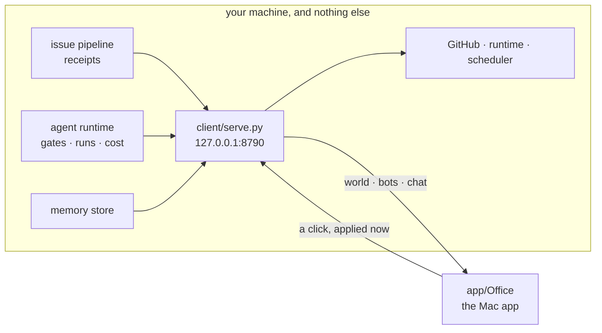

# Where this is going

The office is not a new system. It is a **face** for machinery that already runs
and is currently invisible: an issue pipeline, an agent runtime, a memory store,
a scheduler. What is missing is not capability. It is a place to stand and look
at it. So the design rule for everything below is:

> Adapt, do not rebuild. If a source of truth already exists, the office reads it.
> The office owns exactly one thing: what you see, and what a click means.

## The shape

There is no cloud in this drawing, and that is the whole security model. The door
binds loopback, so the machine is the perimeter; `client/office-sync.py` is the
only process that ever holds a credential.

## Decision routing

Every button resolves to a row here. A feature adds a row, not a subsystem.

| a click | drains to |
| --- | --- |
| comment · close · reopen · label · nudge · merge | GitHub, via `gh` |
| answer a permission gate | `client/runtime.py`, by question id |
| message a bot | `client/chat.py`, one history per bot |
| run a commission · stop a runaway | the runtime |

## The milestones

- **0. Make it readable.** Markdown renders as markdown, desks carry repos,
  states are recomputed rather than looked up. *Landed.*
- **1. The runtime is the brain, in a native app.** Bots you message, desks you
  check, and the raised hand as an interruption you cannot wave away. *Landed;
  the web room was deleted with it.*
- **2. A phone can see the floor.** The same door behind Tailscale Serve, and the
  page it serves at `/` (`client/phone/`, three files, no build) for the screen
  that is already in your hand. Only Aria's tailnet login gets past the door.
- **3. Memory becomes a place.** Semantic recall and the knowledge graph, walked
  rather than queried.

## What this deliberately will not do

- **Own an agent runtime.** Terminals, model routing and budgets belong to the
  runtime. The office shows them.
- **Be an IDE.** There is one of those already.
- **Hold a credential anywhere but this machine.** Every feature has to survive
  that. If a feature needs a token somewhere else, the feature is wrong.
- **Grow a roster file.** Desks are a pure function of the repos you can push to.
