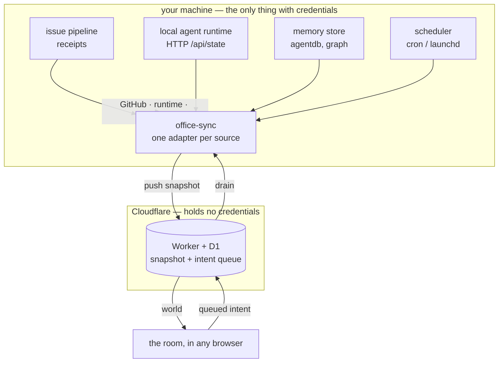

# Where this is going

The office is not a new system. It is a **face** for machinery that already runs
and is currently invisible.

Compare the ambition here to a tool like [munder-difflin][md], which builds its
own agent runtime, its own memory, its own orchestrator, its own IDE. That is a
lot of system to own. This takes the opposite bet: **almost everything on that
feature list already exists somewhere in a working setup** — an issue pipeline, a
local agent runtime, a memory store, a scheduler. What is missing is not
capability. It is a place to stand and look at it.

So the design rule for everything below is:

> Adapt, do not rebuild. If a source of truth already exists, the office reads it.
> The office owns exactly one thing: what the room looks like, and what a click means.

[md]: https://github.com/chaitanyagiri/munder-difflin

## The shape

`office-sync` is already the only credentialed process in the loop. Everything
below is a new **source** it reads, or a new **decision kind** it routes. The
Worker never learns anything new; it stays a dumb, credential-free box.

### Decision routing

Every button in the room resolves to a row in this table. Adding a feature means
adding a row, not a subsystem.

| a click in the room | drains to |
| --- | --- |
| comment · close · label · nudge | GitHub, via `gh` |
| answer a permission gate | runtime `POST /api/permission/answer` |
| run a commission | runtime `POST /api/run` |
| stop a runaway agent | runtime `POST /api/run/stop` |
| talk to the floor | runtime `POST /api/chat` |
| search memory | runtime `GET /api/search` |
| pause a scheduled job | scheduler control |

## Everything is a physical object

The point of a room is that you learn it once and then read it at a glance. That
only works if the vocabulary is fixed and total: every concept gets exactly one
object, and no concept is represented twice.

| concept | object |
| --- | --- |
| a repo | a desk, plaqued with `owner/repo` |
| the agent on it | the villager sitting there |
| an open issue | a sheet in that desk's in-tray |
| waiting on a human | the villager stands up, red `?` |
| a permission gate | the villager **raises a hand**, amber `!` |
| an agent talking to another | an envelope flying desk to desk |
| a commission | a card on the wall board |
| what it cost | the wall chart |
| what is remembered | the library shelves |
| what is scheduled | the wall clock |
| an agent looping or erroring | smoke over the desk |
| no access | an empty chair |

A villager keeps a name because a character you recognise is easier to track than
a string. But the **desk** carries the repo, because that is the thing you are
actually looking for.

## The four milestones

**0 — Make it readable.** Markdown renders as markdown. Desks are labelled with
repos. Repos can be hidden. Villagers move around the floor instead of vibrating
in place. Nothing new is wired; the room just stops fighting you.

**1 — The runtime is the brain.** The office starts reading a local agent
runtime, not just the issue pipeline. Permission gates become raised hands, which
is the single highest-value thing on this whole page: a blocked agent is
currently a line in a log nobody is watching, and it becomes a character standing
up in front of you. You can talk to the floor and start work from the room.

**2 — Coordination becomes visible.** Envelopes, the mailroom, the wall board,
the cost chart, smoke over agents that are looping. Everything the coordination
layer already does, but as motion you can see from across the room.

**3 — Memory becomes a place.** The library and the map room: semantic recall and
the knowledge graph, walkable rather than queried.

Issues are filed against each. Milestone 0 is the only one with a fixed shape;
the rest get re-cut once 1 lands and teaches us what the room actually wants.

## What this deliberately will not do

- **Own an agent runtime.** Terminals, PTYs, model routing and budgets belong to
  the runtime. The office shows them.
- **Be an IDE.** A file viewer, maybe. Not an editor. There is one of those already.
- **Hold credentials in the cloud.** The security model is the whole point, and
  every feature here has to survive it. If a feature needs the Worker to hold a
  GitHub token, the feature is wrong, not the model.
- **Grow a roster file.** Villagers are a pure function of the repo path. Nothing
  in this room is ever a hand-maintained list.
