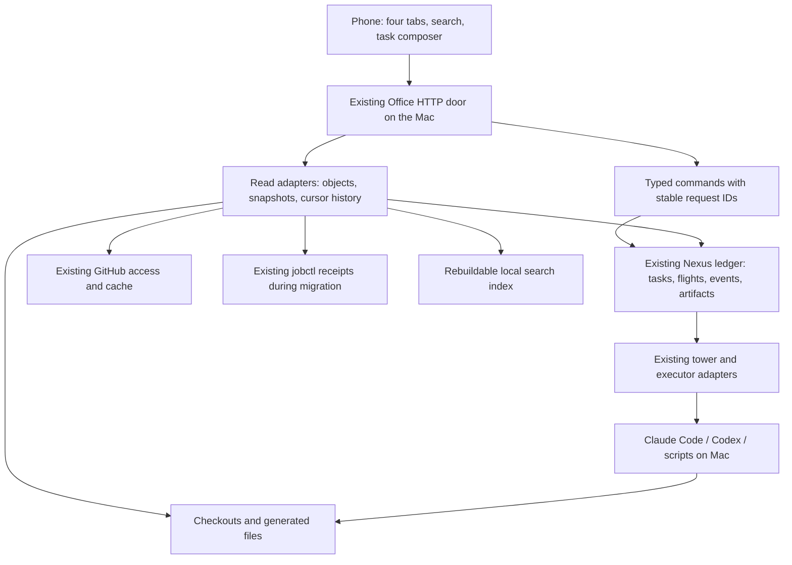

# Mobile Office backend: complete visibility and control from the phone

**Plan for [#157](https://github.com/ariaxhan/nexus-office/issues/157). No backend changes made by this audit.**

The Mac remains the execution host. The phone is a complete authenticated workspace: see the work, start it, steer it, inspect the result. Four tabs: **Today / Work / Library / System**. Global search and New task remain available everywhere. Podcast and Substrate are first-class outputs, not the organizing principle of the whole app.

[Approved interactive HTML](https://github.com/ariaxhan/nexus-office/blob/7591fabb3f50ac9aabe77ededde18f9cbb1f20bf/docs/design/mobile-office-approved.html) is the visual target. Its sample statuses, code, files, logs and simulated actions are not implementation proof. This plan preserves all controls and the broader agreed behaviors behind them.

## What the audit found

| Finding | Consequence |
|---|---|
| Existing Office already has a local API, Tailscale boundary, project snapshots, file reads/writes, agents, gates, bot chat and automation projections. | Extend these; do not build another backend. |
| Running server reports `685cc6dd45e6e29e64c9bb3c300d2e0b75d577fa`; checkout is `ee11162afa9a2c693b510e277f79237a087f2291`. | A source fix is not a live fix. Record and verify serving revision before each acceptance run. |
| Three agent views exist: addressable hcom sessions, process-table observations and Nexus flights. | Join using proven identities; keep observed/controllable distinct. Never infer identity from newest file in a folder. |
| The actual phone has no search input, audio element or web-app manifest. | Search endpoint existence and podcast card counts do not prove phone usability. |
| Search is a bounded Markdown corpus; file direct-read behavior is broader than the listing/documentation claims. | One explicit object/read/search policy is required before expanding full file visibility. |
| Nexus already has a durable ledger, tower, flight artifacts, retries and cancellation. | Put phone commands through these owners, not a second queue or scheduler. |

### Read-only runtime evidence

Observed 2026-09-08 around 02:17 UTC, via local HTTP; this is **not** proof of iPhone/Tailscale behavior:

- `/api/health`: HTTP success, serving revision above, snapshot `2026-09-08T02:12:22Z`.
- `/api/world`: 84 stations, 11 source sections. Sources include care, grader, clock, costs, flows, memory library, mail, money swarm, podcasts, PRs and webhook.
- `/api/sessions`: 4 addressable-record entries; `/api/live`: 3 process observations at the first snapshot. Counts changed by the screenshot and are point-in-time observations, not an invariant.
- Podcast source: 9 locally playable entries; `file://` destinations are not phone streaming proof.
- Clock: 54 job rows, 6 needing attention. Existing “state=ok” can mean the source read succeeded while its headline reports failing work. Separate transport health from product/work health.
- Actual phone at 390px: no horizontal overflow, but the automation section alone measured 8,955px tall; needs section 3,226px. This is why simply restyling the long page will not fix visibility.
- Rendered screenshot inspected. No live agents launched, messages sent, jobs retried, settings changed or service restarted during this audit.

## Capability-by-capability preservation contract

**Reuse** = useful implementation exists, not a claim of end-to-end reliability. **Extend** = partial path exists. **Build** = missing phone/backend contract. Each row has a delivery package below; none is removed or made optional.

### Shell, Today and cross-project visibility

| ID | Capability | Current evidence / gap | Delivery & acceptance |
|---|---|---|---|
| C01 | Four tabs; back/deep navigation; contextual Settings | `phone/index.html` is one band stack plus panels; hashes cover only limited readers. | P6: routed app shell; browser back, reload and tab switches restore the right object. |
| C02 | Connection, serving revision and freshness | `/api/health`, snapshot and source timestamps exist; health OK is not source/work health. | P0/P6: offline/stale/error/empty distinct; Mac revision visible; failed refresh retains last-good data. |
| C03 | Needs you and all approvals | `drawGate`, `drawNeeds`, runtime exact-question gates and issue decisions exist. | P1/P6: all gates across tabs, exact subject identity; no filter hides a gate; stale answer refused. |
| C04 | Working now across projects/accounts | hcom + live process + Nexus flight sources disagree legitimately; counts are different populations. | P1: typed observations joined to durable task IDs; unknown/observed/controllable distinguished. |
| C05 | Since-last-visit results, pinned/recent objects | catch-up and last-seen localStorage; repo pins exist; full object recent history absent. | P2/P6: per-user seen cursor, object links, favorites/recent reading and failure visibility. |
| C06 | Existing Office breadth | care, grader, mail, clock, costs, flows, memory, money swarm, PRs, webhook, lesson previews already exist. | P2/P4/P6: preserve as linked project/system/library surfaces; paginate detail instead of removing it. |

### Work, conversations and account control

| ID | Capability | Current evidence / gap | Delivery & acceptance |
|---|---|---|---|
| C07 | Project roster and known checkout selection | GitHub/receipt roster differs from local checkout discovery; repo slug is not checkout identity. | P2: stable project plus checkout IDs; local-only and multiple-worktree cases visible. No hand-maintained project list. |
| C08 | New task: prompt + project + Claude/Codex | `/api/session/start` launches `hcom --headless`; phone sends only repo/tool; request can block 90s. | P1: prompt control; durable task/attempt ID returned promptly; exact launched session opens. |
| C09 | Personal/TBS account for either engine | Claude directory-based config; missing profile inherits daemon env; Codex no selection. | P1: trusted engine/profile registry, readiness validation, session-scoped env; all four engine/account combinations; never silently fall back. |
| C10 | Reconnect and retry without duplicate starts | No start idempotency key or stable returned session ID. | P1: same request key returns same task/attempt across double tap, disconnect and Office restart. |
| C11 | Continue/steer a task, correct delivery status | `sessions.say` queues hcom message; queue acceptance is not consumption. | P1: persisted message ID with accepted/delivered/consumed-or-unknown states; task conversation survives executor replacement. |
| C12 | Active and completed conversation history | hcom last exchanges and process-bound transcript reader; process exit removes live lookup. | P1/P4: stable engine session ID, cursor history, durable completed records and explicit retention boundaries. |
| C13 | Account-aware transcript association | personal roots only; newest transcript per cwd; Codex today/yesterday scan. | P1: identity captured at launch; import legacy evidence only with confidence/proven match; two same-cwd and >48h sessions tested. |
| C14 | Bot conversations and photo/file references | bot `Room` supports one PNG/JPEG; native sessions lack attachments; bot history is a separate route. | P1/P2: keep bot roster/history; common object attachment references with engine capability adapters and receipt-backed uploads. |
| C15 | Interrupt, stop, resume, permission handling | Nexus flight cancellation exists; hcom reply is not interrupt or tool approval; observed processes are read-only. | P1/P4: explicit per-session capabilities; supported engine-owned stop/continuation; no blind PTY keystrokes; permission waits visible and answerable for Office-launched sessions. |
| C16 | Drafts and selected context survive leaving | phone drafts are in-memory; most navigation is not durable. | P6: local draft store keyed by task/object, revision-aware restore; clear after durable acceptance only. |

### Files, GitHub and inspectable outcomes

| ID | Capability | Current evidence / gap | Delivery & acceptance |
|---|---|---|---|
| C17 | Folder tree, Markdown/code, local/GitHub revision | Context lists Markdown only; direct read accepts other in-root text; no GitHub tree/file routes. | P2/P3: paged browse, MIME-aware read, source/checkout/branch/revision identity; file outside search cap still opens safely. |
| C18 | Full document reader and source toggle | basic Markdown renderer exists; no complete code/artifact handling. | P2/P6: safe Markdown, source/line numbers, bounded chunked large-file reads, no silent truncation. |
| C19 | Edit document, preview diff, safe save | `/api/context` POST compares expected text and atomically replaces; UI editor absent; JSON size envelope may reject near-limit edits. | P2: expected content hash/revision, byte-safe body limit, conflict response, serialized Office writes; retain a conflicted draft and both versions. |
| C20 | Ask agent about exact file/change | no shared resource identity in composer. | P1/P2: attach object+revision+selection, not guessed path; reference opens same content and subsequent revision is labeled. |
| C21 | Issues and complete discussions | snapshot bodies clipped to 4,000 chars and last comment 1,500; general pagination/detail missing. | P3: on-demand full body/comments/timeline; create and reply through existing account-aware access path. |
| C22 | PR diffs, changed files, checks and reviews | all PRs now visible in source; bodies clipped; no full diff/review route. | P3: paginated changes, blob fallback for omitted patches, checks tied to head SHA, inline review context. |
| C23 | Review/merge/issue actions | issue comment/relabel/close/reopen and pipeline-only merge exist. | P3: typed actions plus capability reasons; keep current merge restrictions and exact-head checks; visibility never implies write permission. |
| C24 | Actual previews/deployments/downloads | lesson-preview routes and external links exist; general artifact browsing absent. | P2/P3: artifact ID to actual bytes or verified URL; build/commit/publish/verified distinct. Missing/offline output says so. |

### Global search and Library

| ID | Capability | Current evidence / gap | Delivery & acceptance |
|---|---|---|---|
| C25 | One global search, all tabs | `/api/search` only local indexed Markdown; no phone search control. | P2/P6: type filters and common result links; names, paths and contents. |
| C26 | Every agreed corpus | code, GitHub discussions/diffs, chats, logs, podcasts, Substrate absent from current search. | P1–P5: each source adapter contributes searchable documents; per-source indexed/total/stale/error/unsupported coverage. |
| C27 | Search pagination and fresh exact opens | 40 name + 40 text hits, 3s text deadline, 120s name cache; unreadable sources can become empty. | P2: cursor pages, deterministic ranking, changed/deleted document invalidation and explicit incomplete result status; object opening independent of index inclusion. |
| C28 | Readable Library collections, recent and saved | current “Library” is AgentDB/semantic memory, not artifact library. | P2/P6: documents, notes, research, meetings, code/artifacts, memory, podcasts, Substrate; existing memory stays reachable. |
| C29 | Substrate gallery and piece presentation | generator and local `pieces/manifest.json` exist outside Office; no Office source. | P5: index existing pieces, title/excerpt/date/type, isolated interactive viewer, text alternative and link to generation/publishing evidence. |
| C30 | Podcast catalog, latest, resume and chapters | manifest + local-path cards only; no HTTP audio/player. | P5/P6: artifact URLs with range reads, chapter timing, transcript/sources, saved playback progress and persistent audio element. |
| C31 | Automatic 20–30 min chosen-Qwen edition | daily script hook exists; audio still paused in runner; Qwen success is dated one-off renderer. | P5: one scheduled pipeline with staged durable outputs, length/audio checks, automatic publish and independent notify retries. |
| C32 | Podcast controls, background/lock screen | no audio element, media CSP, manifest or runtime phone proof. | P5/P6: play/pause/±15-second skip/seek/speed/mini-player, lock-screen media controls and actual iPhone background test; runtime packaging decision if browser cannot meet bar. |

### System and Settings

| ID | Capability | Current evidence / gap | Delivery & acceptance |
|---|---|---|---|
| C33 | Machine health, activity, connection | live process adapter and health endpoint exist; not a complete machine-health page. | P4: bounded Mac probes, timestamps and permission failures; System doesn't equate HTTP OK with healthy jobs. |
| C34 | All schedules, runs and actual logs | jobctl clock, flow receipts and Nexus run_board exist; clipped snapshot history, no general paged log route. | P4: owner-qualified run identity, history cursor, byte-offset logs including rotation/truncation; no arbitrary file-path log API. |
| C35 | Pause/retry/cancel supported operations | Nexus CLI verbs exist, phone routes missing; jobctl owns separate jobs. | P4: call current owner through typed server actions; new attempt linked to old; terminal outcome and side-effect reconciliation. |
| C36 | Theme, background and accent | mockup-only; current page fixed dark. | P6: validated preferences apply globally, readable foregrounds, system-theme following unless overridden. |
| C37 | Interface/reading fonts, size, density, touch | mockup-only. | P6: preference schema; system fonts bundled/fallback; 320px at 130% text and roomy density has no overlap. |
| C38 | Haptics and reduced motion | mockup-only; device capability unverified. | P6: capability-detected haptics; no feedback-demo control; disabled/unsupported honest; honor OS reduced-motion preference. |
| C39 | Remember position, mini-player, speed, defaults | mockup-only/in-memory. | P5/P6: durable validated settings; opt-out respected; reset all fields; current playback reacts without restart. |

## Simplest architecture that preserves the destination

**Decision:** reuse `nexus/ledger.py`, `tower.py`, `work.py`, flight artifacts and lifecycle; extend the Office door. No new cloud executor, orchestration daemon, generic shell endpoint, second authoritative run database or five tab-specific backends.

- Existing foundation documentation already requires one ledger/tower and gradual removal of legacy owners. Source currently still has hcom, jobctl and tower. During migration, report their explicit owner and proxy commands to it; never let two schedulers own the same workload.
- Flight/task IDs remain operational truth. Engine session IDs, account profile IDs and checkout IDs are fields/references, not new competing task abstractions. Long-lived conversation is bound to the task, not to a PID or one execution attempt.
- Search is a derived index, not a second work database. Prefer a separate rebuildable SQLite FTS file so bulk indexing doesn't contend with the operational ledger. No vector service required for exact names/paths/body search; later semantics cannot replace complete lexical access.
- One object reference shape connects the tabs: `{kind, owner, id, project_id?, checkout_id?, revision?}`. File keys include root identity + relative path + source/ref; GitHub objects retain repo/number/head SHA; artifacts retain producing flight. It is a link contract, not a new entity framework.
- One common read envelope: `{items|object, observed_at, source_revision, freshness, coverage, next_cursor, capabilities}`. State names in the UI are projections; never change a flight’s domain state to make a label convenient.
- One asynchronous work-command result: `202 {task_id, flight_id?, request_id, state, status_url}`. Persist request key + payload hash before launch; conflicting reuse is 409. Accepted is not running, sent is not consumed, produced is not published. Reconcile before replay after an uncertain provider side effect. Immediate preference/pin updates, exact gate answers and revisioned file saves remain synchronous writes returning the new version/receipt; they do not create artificial tasks or flights.
- Personal/TBS agent accounts and GitHub acting identities are separate concepts. Server owns profile paths. Request selects an allowlisted profile ID only. Clear inherited engine auth variables; verify engine/account identity without printing secrets. Existing credentials and hooks remain on the Mac.
- Keep authenticated loopback/Tailscale design, Host/origin/JSON checks and approval identity validation. Full visibility means all work objects, not raw token/config stores. Search, read, attachment and preview paths share the same policy.

### Why not the alternatives?

| Approach | Verdict |
|---|---|
| Add more buttons directly to today's routes | Quick but preserves unreliable identity, duplicate launch risk and clipped history. |
| Replace backend with a new remote control platform | Duplicates existing lifecycle, adds migration risk and another source of truth. |
| Extend the existing owners with shared identities/read contracts | Chosen: smallest route to every approved feature; migrate/decommission legacy paths only after parity proof. |

## Delivery packages, dependencies and concrete acceptance

### P0 — Establish truth and a safe baseline

**Owns:** source/runtime revision checks, failing-test classification, capability inventory, per-function complexity baseline.

- Record serving process revision, CLI/hook readiness, profile availability, known checkout roots and provider health without reading credential contents.
- Reproduce historical failure cases with fixture data. Do not assume memories describe current bugs: the Markdown 2,000-file cap and non-pipeline PR visibility are already fixed in this checkout.
- Install a project-owned complexity gate before implementation refactors: current over-budget functions grandfathered at measured values; no increases/new violations; touched functions over 15 split unless narrowly justified.
- Python backend baseline uses Lizard; JS/TS report currently uses incomplete Lizard fallback. Set up ESLint/AST analysis before claiming frontend complexity improvement. Do not treat fallback measurements as AST proof.
- Gate migration runs through the normal parent verification command: seeded violating fixture fails, clean tree passes. Keep the gate runner in the project, not a plugin-cache path.

**Acceptance:** exact source being served known; test failures assigned; smoke probes are read-only; measurement baseline reproducible. No runtime rewrite required to start P1.

### P1 — Make a phone-created task dependable

**Depends:** P0. **Files:** `sessions.py`, `live.py`, `runtime.py`, `chat.py`, `serve.py`; Nexus ledger/tower/work/radio seams.

1. Add trusted engine/account readiness and explicit capabilities; verify all four selections.
2. Persist task/launch request before starting an adapter; return task identity immediately. The selected checkout supplies context and an explicit source revision (including an explicit captured dirty patch when requested); agent execution uses the foundation’s disposable clone, never a worktree or unannounced writes to the human checkout. Artifacts and integration return through the existing landing policy. Keep origin checkout and execution workspace distinguishable in file views. Start through Nexus's existing flight lifecycle; hcom may remain an executor transport during migration, never a separate lifecycle authority.
3. Capture engine session/transcript identity from launch output/hooks. Map to exact task/attempt; don't scan latest-by-cwd to identify new launches.
4. Add durable task messages with provider delivery status, attachment references and cursor transcript history. `nexus/radio.py` currently offers best-effort notification (silent is valid), not a durable chat queue; add persisted message events and acknowledgements to the existing ledger before using radio as a wakeup hint. Bot conversations keep their existing experience and receive the same object references.
5. Expose safe per-adapter interrupt/stop/resume/permission behavior. A watched external process remains read-only unless an actual supported attachment path is proven; explain this on the row.
6. Route gates by exact pending ID/revision; keep existing locks and rechecks. Reconcile foundation’s removal of routine waiting gates with the newer approved mobile requirement: preserve current pending approvals and engine permission requests; forbidden actions are structurally refused, reversible work proceeds without manufacturing new approval ceremonies. A text “yes” to an agent is not a tool-permission answer.

**Acceptance:** phone-visible launch → reply → file result; disconnect during each step; double tap; restart Office mid-launch; expired/missing account; two same-folder sessions; terminal session still readable; unsupported control doesn't appear. Mock transports plus one isolated real session per engine/profile before release; no production conversations used as fixtures.

### P2 — One file/object access layer and complete local search

**Depends:** P0; attachments integrate with P1. **Files:** `context.py`, `search.py`, `sessions.py`, `private_state.py`, artifact readers.

- Resolve project/checkout independently of roster and polling state; unify local discovery, remote metadata and multiple checkouts without collapsing them into a repo slug.
- Define browse/read/write capabilities explicitly. Keep known-path direct opening independent of search inclusion; remove accidental policy fallback instead of reinstating listing caps. Shared checks for protected stores, path traversal, symlink boundaries, MIME and bounded size/chunk reads.
- Current source proof: disposable fixture index listed only README.md, but direct read returned 200 for both sample.py and a fake `.env`. No real secrets read. `context.write` calls that broad reader; its stated Markdown-only contract isn't enforced by suffix in the write path. Resolve these inconsistencies before expanding the browser.
- Preserve optimistic edit conflicts, improve revision/hash protocol and request-size envelope; protect from concurrent Office writers and detect external changes at commit point. Do not claim atomic rename alone prevents all external-writer races. Phone direct-edit is an explicit user edit, separate from agent execution. Flights always use disposable clones per foundation policy; patch/landing rules govern integration back to the selected checkout.
- Index local text incrementally, invalidate on file/rename/delete events plus periodic reconciliation; expose coverage and cursor results. Add title/path ranking and exact-open links.
- General artifact download and image/document previews reuse object access; unsupported binary is a labeled download, not mangled UTF-8.

**Acceptance:** files past 2,000 entries, code and Markdown, multiple worktrees, CollabVault material, cross-repo search, large files, rename/delete, traversal/symlink/protected stores, agent edit during phone draft, expired cursor and incomplete index all behave honestly.

### P3 — Complete GitHub work and result inspection

**Depends:** P1/P2 identities. **Files:** `office-sync.py`, `serve.py`, existing landing/verification owners.

- Keep cached summary query/budget behavior, but fetch full issue discussion, PR changed files, blobs and checks on demand with pagination. Add remote branch tree/file identity to P2.
- Create issues/comments/reviews through existing access resolver; add idempotency receipts and provider reconciliation for ambiguous sends. Preserve default-branch and pipeline merge policies.
- Checks, review comments and merge target bind to the displayed head SHA. New head forces review refresh. Omitted GitHub patches require blob/diff fallback, never “no changes.”
- Represent code committed, PR opened, deployment published and live verified separately. Link actual output from artifacts/known preview routes.

**Acceptance:** non-pipeline PR visible, >100 PRs/comments paginated, long bodies intact, rate-limited account, missing remote permission, changed head, merge refusal and retry after provider acceptance. Complete visible issue → diff → discussion → result path.

### P4 — System that shows actual logs and real controls

**Depends:** P1 identity/actions; P2 read contract. **Files:** `run_board.py`, `automation.py`, `sources/clock.py`, `sources/flows.py`, `serve.py`, Nexus CLI owners.

- Extend existing run projection: today summary lightweight; log bodies loaded by ID on demand with cursor/byte offset. Retain run history beyond existing 24h/12-runs/16-families view; summaries may cap display, detail access may not disappear silently.
- Resolve logs only from server-owned task/flight/job receipts. Bound reads; detect rotation and UTF-8 boundaries. Show raw and readable events; secret filtering at ingestion/export, not arbitrary shell/tail endpoints.
- Expose flight retry/cancel and schedule pause/enable through the current authority. Nexus uses tower/ledger verbs; remaining jobctl jobs use the registry workflow. Public API accepts action+target ID, never shell command, arbitrary path or plist.
- Project-agnostic machine health with bounded probes. Include ownership, freshness, last success and failure cause. Add run-to-task/artifact links and search ingestion.
- Migrate legacy schedules to tower only as a separate parity-tested step; imported historical receipts preserve provenance. Each migrated job must land three times before its predecessor plist/wrapper is deleted, per foundation. Disable predecessor scheduling before tower owns the job; record ownership transfer, rollback and any unfinished run. Rollback cannot activate both owners. Delete the old path after the three proofs rather than leaving permanent dual machinery.

**Acceptance:** find a historical failed run, open exact log, retry once, observe new attempt and artifact; stop targets exact owned process tree; duplicate retry/restart cannot create two owners. Unknown health is not green.

### P5 — Podcast and Substrate as real artifacts

**Depends:** P2/P4; independent of GitHub review rollout. **Owner boundary:** editorial generation remains Vaults-owned; Office indexes/serves/controls through its owner.

- Extract the dated Qwen renderer into the existing editorial pipeline, preserve the selected reference voice, and turn the paused draft path into automatically published 20–30 minute episodes. Work recap + world/AI + substantial history/discovery; evidence-led narrative inspired by the three named shows, not copied scripts.
- Stage raw source packet, script, voice chunks, final audio, chapter/transcript/source metadata, validation and publication receipt. Resume from completed stages; keep source/script hashes. Time target measured on rendered audio; insufficient research is an explicit failed/short exception, never padding or false 20-minute metadata.
- Publish catalog entry only after complete audio checks. Notification is a separate retryable side effect. Failure must not republish old audio, duplicate episode or consume material that never produced an accepted script.
- Migrate existing 9 manifest entries and weekly Qwen output with original IDs/source receipts; deterministic IDs/date/edition keys. One catalog contract, audio streamed by artifact ID with MIME, length, Range/206/416 and access checks.
- Substrate source: `_meta/services/taper-site/pieces/manifest.json`; generator syncs to `~/.cache/substrate` and `ariaxhan/substrate`. Existing source only has file/date/type/timestamp. Derive/read title/text safely, preserve interactive HTML, record generation source and publish verification separately. Do not infer live deployment from git push output.
- Interactive generated HTML runs in an isolated sandboxed preview surface without Office credentials, same-origin privileges or parent navigation; approved scripts run only there. Keep restrictive Office CSP and add precise audio/preview directives; never render generated script in the main Office origin.

**Acceptance:** episode rendered with chosen voice, 20–30 minutes, published once, seek over phone connection, source notes reachable; interrupt render and notify then recover; older episodes still open. Substrate piece displays, its text is searchable, and scripts cannot call Office writes. Actual iPhone background/lock-screen audio proof required.

### P6 — Connect the approved frontend and persistent settings

**Depends:** P1–P5 for complete acceptance; shell can develop against contracts earlier.

- Today / Work / Library / System use common objects and capabilities; no summary replaces access to the underlying work. Source sections become linked detail, not an unbounded home-page dump.
- New task form, global search, file reader/editor/diff and artifact views use the real APIs. Remove every mock row/action. Nested pages keep project context, browser back and deep links.
- Preferences: theme + custom background/accent + interface/reading fonts + size/density/touch + motion/haptics + position/mini-player/speed/reset. Versioned per-user settings on Mac; device overrides for physical capabilities; local cached preference for first paint. Local drafts/position in IndexedDB with acknowledged sync; no offline replay of write actions without idempotency and user intent.
- A persistent audio controller outside route replacement; one selected episode, durable position and no restart when tabs change. Respect the mini-player and remember-position settings.
- Add installable shell and reconnect behavior if used as a home-screen app. Existing PWA probe is tooling only; it does not prove the product has a manifest/service worker. Cache shell carefully, never silently present cached operational data as current.
- Detect phone capabilities. If web runtime cannot provide required haptics/background media behavior, record the exact device/browser result and deliver a minimal native shell over the same API; do not rewrite the Mac backend or claim unsupported haptics work.

**Acceptance:** real phone, Mac locked but awake, supported network; all mockup routes/actions; 320/390 widths, large fonts + roomy controls, keyboard/safe-area navigation, no overlap, tab switches while playing, reconnect with draft intact, settings reset across pages. Machine health and logs stay System; podcast never crowds out work.

## Proposed API delta (additive compatibility)

Names are proposed contracts, not existing endpoints. Keep legacy GET/POST routes until native Mac and phone consumers have parity; route handlers delegate, not duplicate domain logic.

| Surface | Minimum contract |
|---|---|
| Runtime capabilities | `GET /api/capabilities`: engine/profile readiness, read/control/support reasons, serving revision |
| Tasks | `POST /api/tasks` with request ID; `GET /api/tasks/:id`; cursor task list/events |
| Conversations | task messages/history + attachment object IDs; delivery receipts; exact gate answer |
| Objects/files | `GET /api/objects/:id`, browse by checkout/ref + cursor, revision-bound read/write, byte/range content |
| Search | existing `/api/search` extended compatibly with type/source/coverage/cursor; new source adapters |
| GitHub | detail/comment/diff/review actions bound to repo/object/head SHA; use existing auth owner |
| System | run list/detail/log cursor; typed retry/cancel/schedule actions using owner ID |
| Media/library | artifact/catalog projections, audio range content, sandboxed HTML preview, favorites/position |
| Preferences | validated versioned settings read/update/reset; device capability overrides |

Existing `/api/gates`, `/api/context`, `/api/session/*`, `/api/chat` and Mac API must not break during rollout. New permission/account behavior is an explicit requirement-driven change, not a silent refactor.

## Failure-oriented acceptance ladder

1. **Pure contracts:** seeded records for every C01–C39. Assert unknown vs empty, cursor coverage, identity mapping and capabilities.
2. **Boundary tests:** actual HTTP auth/origin, safe files, MIME/range, JSON size and expected-revision conflict.
3. **Crash tests:** kill/restart Office or adapter after persistence, during spawn and after side effect; one durable command, one owned attempt, no lost acknowledged message.
4. **Provider tests:** isolated real Claude/Codex sessions for both profiles, exact transcript association, permission wait, send/consume status; GitHub test repo for comment/diff/review/merge policy.
5. **Visible phone journeys:** tap New task → choose profile → steer → file → edit/diff → result; search across every corpus; open logs/retry; play and navigate; open Substrate; modify settings.
6. **Deploy proof:** serving revision equals shipped artifact; Tailscale on phone verified separately from localhost; Mac stays awake/locked; record remaining device limitations. Screenshot cannot prove a command ran, and a 200 cannot prove the user can reach it.

No implementation phase is accepted based solely on green unit tests, installed binaries, a card count or a log line saying “sent.”

## Measured simplification baseline

Measured once with kernel 9.10.3 `complexity.sh --all`, Lizard backend analysis. Full TSV saved with this plan. Selected high-complexity integration points:

| Function | CCN | Refactor boundary |
|---|---:|---|
| `client/sources/pipeline.py:card` | 60 | Keep card projection small; move detail assembly out of summary. |
| `client/chat.py:office_evidence` | 56 | Source collectors + bounded serializer; retain exact evidence/coverage. |
| `client/serve.py:do_GET` | 46 | Route lookup table with shared guards; domain rules stay in owners. |
| `client/serve.py:validate` | 37 | Named action validators; one validation contract per action. |
| `client/automation.py:build` | 31 | Separate summary, schedule and history projections. |
| `client/live.py:parse_claude_line` | 27 | Typed transcript event parsing; account/identity fixes not regex sprawl. |
| `client/board.py:read_feed` | 26 | Cursor/filter reader separate from rendering. |

**Do not simplify unrelated card functions merely to improve a number.** Baseline existing debt, touch the required seams, measure before/after with the same engine. New or touched functions target CCN ≤15; exceptions require narrow documented budgets. JS AST baseline remains a P0 requirement.

## Audit limitations and verification record

- Inspection/plan only. No product code changed; no implemented-feature claim. Shared repository retained its pre-existing untracked `graphify-out/`.
- Source evidence pinned to `ee11162afa9a2c693b510e277f79237a087f2291`; runtime revision recorded separately. Vaults service observations are a working-source audit, not pinned deployment proof.
- `npm test` baseline result: passed (exit 0): 1,147 Python tests, 1 Node probe-contract test, then Xcode/Swift tests completed. Resource/fork and Xcode destination warnings present; no test failures. This does not certify missing phone journeys or deployed revision..
- Independent verifier: `/root/verify_scope`; source review of launch/accounts/transcripts/gates plus final preservation review. All 39 capability rows accounted for; reviewer’s four corrections incorporated: three-run migration proof, disposable clones, approval boundary and no artificial flights for synchronous writes. Explicit ±15-second player controls added. No duplicate concurrent test suite.
- 39/39 capability rows have owners, delivery packages and acceptance routes. Backend reduction/gate claims are **not applicable yet**: this turn produces the plan, not a refactor. P0 carries the required seeded-red/clean-green complexity gate and each implementation PR needs independent verification.

## Source evidence index

All Office links below refer to the audited checkout commit, not necessarily the running process:

- [HTTP routes, access boundary and CSP](https://github.com/ariaxhan/nexus-office/blob/ee11162afa9a2c693b510e277f79237a087f2291/client/serve.py#L163)
- [Phone layout](https://github.com/ariaxhan/nexus-office/blob/ee11162afa9a2c693b510e277f79237a087f2291/client/phone/index.html#L15), [phone interactions](https://github.com/ariaxhan/nexus-office/blob/ee11162afa9a2c693b510e277f79237a087f2291/client/phone/phone.js#L915)
- [Launch/account routing](https://github.com/ariaxhan/nexus-office/blob/ee11162afa9a2c693b510e277f79237a087f2291/client/sessions.py#L449), [live transcript identity](https://github.com/ariaxhan/nexus-office/blob/ee11162afa9a2c693b510e277f79237a087f2291/client/live.py#L244)
- [File policy and writes](https://github.com/ariaxhan/nexus-office/blob/ee11162afa9a2c693b510e277f79237a087f2291/client/context.py#L227), [search corpus](https://github.com/ariaxhan/nexus-office/blob/ee11162afa9a2c693b510e277f79237a087f2291/client/search.py#L90)
- [GitHub summary/PR visibility](https://github.com/ariaxhan/nexus-office/blob/ee11162afa9a2c693b510e277f79237a087f2291/client/office-sync.py#L626)
- [Run projection](https://github.com/ariaxhan/nexus-office/blob/ee11162afa9a2c693b510e277f79237a087f2291/client/run_board.py#L16), [existing CLI actions](https://github.com/ariaxhan/nexus-office/blob/ee11162afa9a2c693b510e277f79237a087f2291/nexus/cli.py#L28)
- [Ledger](https://github.com/ariaxhan/nexus-office/blob/ee11162afa9a2c693b510e277f79237a087f2291/nexus/ledger.py#L1), [foundation ownership](https://github.com/ariaxhan/nexus-office/blob/ee11162afa9a2c693b510e277f79237a087f2291/docs/foundation.md)
- [Podcast path contract](https://github.com/ariaxhan/nexus-office/blob/ee11162afa9a2c693b510e277f79237a087f2291/client/sources/podcasts.py#L1), [all existing sections](https://github.com/ariaxhan/nexus-office/blob/ee11162afa9a2c693b510e277f79237a087f2291/client/sections.py#L28)
