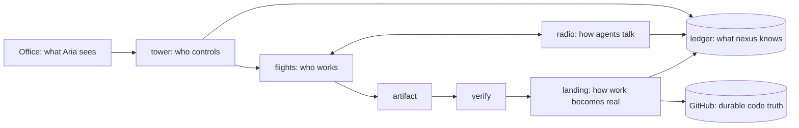
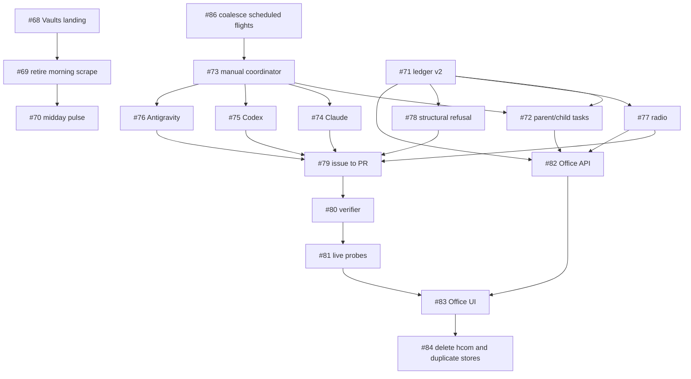

# The engine under the Office

🔧 ready to build. The Office stays; the machinery beneath it becomes one tower process, one
ledger, and one flight runner. Tower, flights, radio, landing, and Office remain capabilities, not
five separately built subsystems.

Aria, 2026-09-03: "kill anything. restart nexus. no corruption, no lost durable work, no
ambiguous state." And: "reliability code gets a complexity budget too. nexus should become
smaller as its invariants improve."

The newer operating rule is stronger: **a clear request or issue is already a decision. Decompose,
delegate, do, verify the visible result, continue.** Tower must not turn execution into another
planning, question, review, or gate factory.

## Vocabulary, and it is a constraint

airport = nexus · tower = control · airline = a repo or product · task = flight plan · flight =
one execution attempt · aircraft = the executor (claude, codex, antigravity, script) · crew = the
agents on a flight · radio = communication · ledger = the flight recorder · hangar = isolated
workspace · landing = integration · office = the departure board.

No synonyms: unit, run, session, job, commission and lane all meant roughly "flight" and are
retired in code, docs and UI. No new primitive without deleting one or proving these cannot
express it; a new concept is a field or a state. **Tower stays domain-blind.** Airlines own their
objectives, rules, verifiers, workflows and context; if tower ever knows what a lesson, an issue, a
care reply or a deployment is, that is airline logic in the wrong place. A component that cannot
be explained in this model is questioned, not kept. The permanent question: does this help an
airline fly, or are we building more airport?

## The capability boundaries

| capability | owns | implementation |
|---|---|---|
| **tower** | scheduling, leases, lifecycle, budgets, cancellation, retries, health | one process; launchd only keeps it alive |
| **ledger** | plans, tasks, flights, artifacts, messages, events, leases | one versioned SQLite file |
| **flights** | Claude, Codex, Antigravity, scripts, scheduled work | one runner contract; executor selected by plan data |
| **radio** | durable task conversation and delivery | ledger events plus a small send/read API; no daemon |
| **landing** | verify, integrate, record, recover | tower state transitions plus Git; no service |

Office is a projection of the ledger. GitHub is code truth. Ledger is operational truth. A
click in the Office becomes a ledger row that tower acts on.

## Every existing component maps to one primitive or dies

| today | becomes |
|---|---|
| 43 launchd plists, `jobrun`, `jobctl`, `registry.jsonl` | scheduled **flight plans** in the ledger; one plist keeps tower alive |
| hcom registrations, presence, kill, `hcom list` | **tower** (leases) |
| hcom messaging, `hcom send`, `hcom transcript` | **radio** |
| vault-git-lock, stash guard, autocorrect-bash, index.lock advice | gone: isolation makes them unreachable |
| vault-autopush, nexus clean's sweep, session branches, wip refs | **landing** |
| dispatch worktrees, leaked-worktree sweeper, `.worktrees/` | tower creates and destroys flight workspaces |
| session enrol hooks, `_meta/state/` registries, `ACTIVE.md` | automatic flight creation; ACTIVE is a ledger view |
| receipts jsonl, tool-error census, self-audit, `jobctl status`, wip-mirror census | **ledger** queries |
| board files, office bots, board-responder | ledger events; the feed is a view |
| webhook queue (loses dispatch after a 2xx on restart) | durable **events** in the ledger, acknowledged after commit |
| issue pipeline, care pipeline, lesson pipeline, release controller | flight plans plus product-specific verifiers |
| gates (`_meta/state/gates`) | deleted; bounded work is decomposed, forbidden actions are structurally refused, and unrelated work continues |
| 76 hooks | only last-line safety boundaries: client default-branch push, secrets in tree, money. Everything else deleted with a test proving the class is unreachable |

A new process, database, protocol, or framework needs proof that this model cannot deliver the
required behavior. A new concept should first be a field, event kind, or state.

The loop: `request or issue → do → verify the real surface → land → probe → next ready item`.
Watchers add work to the same loop. Aria owns goals and hard boundaries; never routine task
generation, troubleshooting, sequencing, or approval.

## Functionality invariant

Simplification may merge storage, code paths, or delivery phases. It may not remove any outcome.
The sole explicit scope change is the later instruction replacing human gates with decomposition
and structural refusal:

- objectives with inherited autonomy boundaries;
- scheduled, event-driven, and directly requested work;
- observations, ranking, deduplication, policy decisions, and task generation;
- Claude, Codex, Antigravity, script, watcher, coordinator, resolver, and reviewer flights;
- durable task conversations, executor replacement, and Office replies;
- deterministic recovery, retry, diagnosis, repair, alternate approach, rollback, and quarantine;
- plan-specific verification, recoverable landing, and untouched human checkouts;
- Office visibility for noticed, decomposed, delegated, doing, failed, and fixed;
- degraded operation when GitHub, radio, verifier, or Office is unavailable;
- migration and deletion of every mapped legacy mechanism.

## Operating constraints from the September 3 transcripts

- Explicit request or filed issue: enqueue immediately. No candidate/ranking ceremony first.
- Large work starts with one bounded coordinator flight that writes child tasks with one
  unambiguous output, owned paths, and check. Tower schedules that data; it does not reason.
- Each child goes to one appropriate subagent flight. File-disjoint children may run in parallel;
  shared surfaces and integration remain serial. No agent receives an issue-sized one-shot prompt.
- Verification is its own bounded flight only when consequence requires independence; no councils
  or reviewer fan-out.
- Issue work ends in a pushed PR; review, merge, and post-merge proof follow automatically.
- Non-issue work uses the airline's landing rule; no feature branch merely because an agent ran.
- Disposable clones provide isolation. No worktrees and no writes to human checkouts.
- Verification targets the requested surface: deployed page, staging route, running process,
  database row, screenshot, or receipt. Internal tests are supporting evidence only.
- Run only tests protecting money, data, permissions, or a demonstrated regression; run once at
  the landing boundary. Delete tests that only preserve implementation ceremony.
- After each result, take the highest-priority ready item. Money, client default-branch push,
  speaking as Aria, and unrecoverable deletion are refused unless already authorized; they do not
  create a waiting gate. For ambiguity, use the most reasonable reversible interpretation, record
  the assumption, and continue.
- Deterministic live probes file breakage immediately and place it ahead of routine work.
- Infrastructure work must fix a current failure or immediately delete a replaced mechanism.

## Manual first, then automate

Decomposition is authored by hand before any decomposition process or skill exists. Freeze the
destination, draw dependencies, create bounded child issues, execute them, and observe where
coordination fails. Only then encode the repeated minimum. This applies to every new Nexus
workflow: **do it manually once; automate the proven path, not the imagined one.**

Canonical tracker: [#85](https://github.com/ariaxhan/nexus-office/issues/85). Every node is an
actual subissue with its own output and acceptance check.

Ready now: #86, then #68, #71, and manual decomposition #73. Migration, schema, and manual
coordination are file-disjoint; integration remains serial.
Every further airline migration gets its own child issue before work begins.

## Ledger model

One file: `~/Library/Application Support/nexus/ledger.sqlite`, WAL mode, `PRAGMA user_version`
for migrations, copied to `ledger.sqlite.bak-<version>` before any migration.

Target: seven tables hold all functionality. Objectives, observations, and messages are
typed data inside them until measured query or integrity needs justify normalization. The current
live v1 ledger still has the four removed tables while a fresh v1 creates seven; migration v2 must
copy their remaining data into the target fields/events, verify parity, then drop them. The same
schema version may never describe both layouts.

| table | owns |
|---|---|---|
| `plans` | standing responsibility, objective and autonomy boundary, schedule or event trigger, executor, inputs, outputs, verifier, budget, recovery policy, resources, enabled/quarantined state |
| `tasks` | accepted work, one-sentence objective and autonomy boundary, parent task, source, reason, priority, dedupe key, state, declared output and check |
| `flights` | attempt state, task/plan, lease, workspace, process, structured result, attempt, resolution step |
| `artifacts` | files, branches, receipts, screenshots, failure evidence |
| `landings` | target, expected SHA, verifier flight, recoverable apply state |
| `events` | append-only state history, observations, and radio messages with delivery metadata |
| `leases` | shared mutable targets: repo+branch, mailbox, deploy slot, paid budget |

The current fresh schema does not yet carry objective/autonomy or delivery metadata. Those
fields arrive through the v2 migration before the corresponding capability moves onto this model.

Rules enforced in the ledger layer, not by callers: every write is a transaction that also
appends an `events` row; `flights.state` transitions follow a fixed table; a flight may not be
`landed` without a `landings` row in `applied`; history rows are never updated or deleted.

## Contracts

**Flight.** Input: plan row plus a fresh workspace (`git clone --shared` of the target repo under
`~/Library/Application Support/nexus/flights/<id>/`, or an empty dir for non-repo work).
Output: a `result` json `{ok, artifacts[], error{code, detail}, cost}` written by the runner, never
parsed from logs. Budget enforced by tower: timeout, turns, cost, retries. Workspace deleted after
landing or failure; artifacts survive in the ledger and on GitHub.

**Landing.** Verify flight runs the plan's verifier against the artifact (tests, parity, screenshot,
product check). GitHub and sqlite cannot share a transaction, so landing is a recoverable state
machine: `verified → applying → applied`. Tower records `applying` with `expected_sha`, pushes,
then records `applied`. After any restart, every `applying` row is reconciled by asking GitHub for
the branch tip: equal to `expected_sha` means record `applied`; absent means push again. Idempotency
replaces the atomicity that does not exist. Human trees fast-forward only; tower never writes into a
checkout a person uses.

**Resolution.** The working flight diagnoses, repairs, changes approach, and verifies within its
budget. Tower only performs deterministic recovery, retry, rollback, quarantine, and structural
policy refusal.
A separate resolver or reviewer is another ordinary flight, created only when independence or a
real failure requires it; there is no role framework or resolution state machine. Every original
resolution outcome remains available. Office shows what is happening; Nexus resolves routine
uncertainty and reports afterwards.

**Roles.** Plan = how and when nexus watches or routinely acts. Task = something nexus decided
needs doing. Flight = one attempt to do it. A schedule never creates a flight directly; it creates
an observation or a task, and tower decides.

**Where work comes from.** Explicit requests and issues become tasks immediately. Watchers append
observations for GitHub, failed flights, staging and production probes, stale projects, TODOs,
Office conversations, repo changes, product health, and flight discoveries. Tower deduplicates,
checks the autonomy boundary, sorts by explicit priority, and launches. It does not estimate,
deliberate, or build a generic ranking engine. Every task cites its one-sentence objective and
boundary. A direct request supplies the objective; its trusted arrival surface and standing policy
supply authority. Caller-controlled content never grants authority. The flight does the
judgment-heavy work.

**Communications may fail; lifecycle must continue.** Tower owns lifecycle, presence, leases,
stop, kill and completion. Radio owns messaging only and is never on the critical path of a
flight's completion: a dead or hanging radio cannot keep a flight alive, cannot stop a flight from
recording its outcome or releasing its leases, and cannot block the next flight. Stopping a flight
is a tower operation, never a message or a hook. Until tower provides that, every hcom hook is
capped at 15 seconds and fails open (done 2026-09-03: both Claude silos, both Codex hook files,
`HCOM_TIMEOUT` 86400 to 15, and every registered instance's `wait_timeout` row reset, since the
toml value never touched existing rows); hcom's stop and lifecycle hooks are removed the moment
tower replaces them, which is step 3 (interactive Claude and Codex become aircraft with tower
owning their presence and stop). No watchdog is ever added around hcom. In the engine the seam is
`nexus/radio.py`: a flight's outbound radio is one bounded, killed-on-timeout call made only after
`result.json` is on disk; `tests/crash_tower/test_radio_hang.py` proves a radio that never answers
changes nothing about the flight's lifecycle.

**Radio.** `send(task, to, body)` appends an event before ack. A message belongs to the task's conversation;
delivery targets whichever flight currently holds the task, so Codex can die, Claude can replace it,
and the reasoning survives. The active receiver gets undelivered task messages at its next turn.
Broadcast does not exist. Undelivered messages are visible in the Office.

**Tower loop.** Every tick: expire leases, fail flights past budget, quarantine plans with N
consecutive failures, schedule due plans within a concurrency cap, launch queued flights detached,
reconcile narrowly (pid exists? branch exists? workspace exists?) and repair only that row. Killed
at any instruction, restart rebuilds from the ledger. Escape hatch: `nexus pause`, `nexus kill
<flight>`, `nexus hold-landing`, `nexus retry <flight>`.

## The laws

restartable · idempotent · leases not presence · durable before acknowledgement · atomic
transitions · bounded execution · backpressure · quarantine · degraded mode (GitHub down: flights
still produce; radio down: flights still work; verifier down: landing stops; Office down: tower
continues) · narrow reconciliation · versioned migrations with backup · append-only history ·
structured errors · escape hatch without ssh archaeology.

## Required fault proofs

Keep one end-to-end case per failure boundary: tower death, runner death, machine restart, network
loss, duplicate tick, conflicting lease, disk full, malformed result, verifier timeout, push
rejection, interrupted landing, interrupted message delivery, and hung radio. Cases may share a
harness but every fault remains covered. Each asserts ledger integrity, artifact existence, and
one unambiguous flight state.

## Delivery order: working loops, one small landing at a time

The Office reads these as six columns: noticed, decomposed, delegated, doing, failed, fixed.

## Ceremony budget

Every piece of work is `decide → do → verify → done`; everything between must earn its place.
Risk class picks the process: cheap and reversible: do it, test. Expensive and reversible: brief
plan, do, test. Irreversible or external: verify and refuse unless already authorized. Architectural:
freeze the destination, manually decompose, build one vertical slice. Plans supply priority.
Product work wins by default; infrastructure rises only when it unblocks product work, fixes a
demonstrated serious failure, or immediately deletes net complexity. Tower sorts; it does not
deliberate. Infrastructure is a cost center.

## Success metrics, measured from the ledger

| metric | direction |
|---|---|
| human interrupts per 100 flights | down |
| ambiguous recoveries per 1000 flights | zero |
| successful automatic recoveries | up |
| median recovery time | down |
| permanent mechanisms deleted minus added | positive every month |
| share of flight effort on airline objectives vs nexus itself, shown in the Office as product · infrastructure · recovery | product dominant; infrastructure under 10 |

| step | delivers | accepted when |
|---|---|---|
| 1 script flight: core built, target proof partial | schedule → isolated run → structured result → declared artifact → landing → recovery | three CollabVault outputs and one Vaults output land; tower survives `kill -9`; each remote SHA equals the ledger |
| 2 now: finish script proof | land one Vaults output, then move one scheduled job at a time through the proven path | each job lands three times before its plist and wrapper disappear; finish with one launchd job |
| 3 issue loop | migrate ledger v2; add parent/child decomposition, executor selection, radio, structural policy refusal, and landing policy through the shared runner | a large issue splits into bounded flights; Claude, Codex, and Antigravity each complete real work; issue → PR → review → required staging → merge/promote → post-merge proof runs without routine questions; conversation survives executor death and reaches its replacement next turn |
| 4 live safety loop | add airline-owned deterministic staging, production, health, and low-risk discovery watchers | one low-risk observation is deduped, selected, completed, verified, and landed without intervention; failures file priority tasks immediately; TBS production probe runs every five minutes and proves PR → review → staging → staging probe → main → recurring production probe |
| 5 Office projection | read objectives, observations, decomposition, delegation, flights, landings, and conversations from the ledger while preserving roster, desks, flows, and non-gate controls | the same screens plus the six live columns match ledger state; failures link to their issue, PR, review, landing, and live proof |
| 6 finish migration | repeat the proven loops; delete each predecessor immediately after proof | all scheduled, agent, delegation, radio, watcher, Office, refusal, and recovery behavior remains; hcom and mapped legacy machinery are gone; only three safety-boundary hooks remain |

Status, step 1: core BUILT; target proof PARTIAL. The live ledger has eleven tables; fresh v1 has
seven. Both have WAL, backup, append-only events, and integrity checks. Step 3 owns the clean v2
convergence. Three CollabVault landings succeeded, latest `b5327bb1`; the Vaults landing remains.

Current script-flight core: `nexus/tower.py` tick (leases, budgets, quarantine,
task acceptance, detached launch, narrow reconcile), `nexus/flights.py` runner,
`python3 -m nexus` escape hatch, `nexus/launchd/com.nexus.tower.plist`. `tests/test_tower.py`
25 tests, `tests/crash_tower/test_crash_v0.py` green three runs in a row. Retry and quarantine are
wired; the remaining resolution behavior ships with the first agent flight, not as its own project.

## Coexistence while the engine is built

A real-work lane ships product in these same folders. Nothing it depends on is migrated or
deleted until the replacement is proven end-to-end on real traffic; its activity is the evidence
that sets migration order. Observed dependencies on 2026-09-03: hcom (messaging and presence),
jobctl and launchd plists, wip-mirror post-commit, the tbs-www and tbs-landing release
controllers, the care scripts under `scripts/microsoft-mail`, `bin/tbs-active.py`. Remaining slices
run beside them, never through them, until each has a landed replacement.
