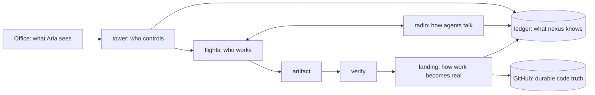

# The engine under the Office

🔧 ready to build. One line: the Office stays; the machinery beneath it (launchd, hcom, receipts,
board files, gates, pipeline, autopush, 76 hooks) is replaced by five primitives and one ledger.

Aria, 2026-09-03: "kill anything. restart nexus. no corruption, no lost durable work, no
ambiguous state." And: "reliability code gets a complexity budget too. nexus should become
smaller as its invariants improve."

## Vocabulary, and it is a constraint

airport = nexus · tower = control · airline = a repo or product · task = flight plan · flight =
one execution attempt · aircraft = the executor (claude, codex, antigravity, script) · crew = the
agents on a flight · radio = communication · ledger = the flight recorder · hangar = isolated
workspace · landing = integration · office = the departure board.

No synonyms: unit, run, session, job, commission and lane all meant roughly "flight" and are
retired in code, docs and UI. No new primitive without deleting one or proving these cannot
express it; a new concept is a field or a state. **Tower stays domain-blind.** Airlines own their
objectives, rules, verifiers, workflows and context; if tower ever knows what a lesson, an issue, a
care reply or a deployment is, that is airline logic in the wrong place. A component that cannot
be explained in this model is questioned, not kept. The permanent question: does this help an
airline fly, or are we building more airport?

## The primitives

| primitive | owns | never does |
|---|---|---|
| **tower** | scheduling, ownership leases, lifecycle, budgets, cancellation, retries, gates, health. One process; launchd only keeps it alive | do work; hold state outside the ledger |
| **ledger** | units, flights, state, artifacts, messages, receipts, events, gates. One sqlite file, versioned, append-only history | live in more than one place |
| **flights** | every unit of execution: claude, codex, antigravity, script, scheduled job. Isolated workspace, explicit objective, input, output, budget | touch a shared or human tree; decide its own success |
| **radio** | durable messages between flights and Aria. Delivered at the receiver's next turn, expire with the lease | decide presence, ownership, lifecycle, or success |
| **landing** | the only path from isolated work to shared state: verify, integrate, record. Atomic | happen without a verify record; half-apply |

Office is a projection of the ledger. GitHub is code truth. Ledger is operational truth. A
click in the Office becomes a ledger row that tower acts on.

## Every existing component maps to one primitive or dies

| today | becomes |
|---|---|
| 43 launchd plists, `jobrun`, `jobctl`, `registry.jsonl` | scheduled **flight plans** in the ledger; one plist keeps tower alive |
| hcom registrations, presence, kill, `hcom list` | **tower** (leases) |
| hcom messaging, `hcom send`, `hcom transcript` | **radio** |
| vault-git-lock, stash guard, autocorrect-bash, index.lock advice | gone: isolation makes them unreachable |
| vault-autopush, nexus clean's sweep, session branches, wip refs | **landing** |
| dispatch worktrees, leaked-worktree sweeper, `.worktrees/` | tower creates and destroys flight workspaces |
| session enrol hooks, `_meta/state/` registries, `ACTIVE.md` | automatic flight creation; ACTIVE is a ledger view |
| receipts jsonl, tool-error census, self-audit, `jobctl status`, wip-mirror census | **ledger** queries |
| board files, office bots, board-responder | ledger events; the feed is a view |
| webhook queue (loses dispatch after a 2xx on restart) | durable **events** in the ledger, acknowledged after commit |
| issue pipeline, care pipeline, lesson pipeline, release controller | flight plans plus product-specific verifiers |
| gates (`_meta/state/gates`, id-addressed, fail-closed) | tower interventions with the same ids and the same fail-closed rule |
| 76 hooks | only last-line safety boundaries: client default-branch push, secrets in tree, money. Everything else deleted with a test proving the class is unreachable |

A sixth primitive needs a written justification in this file. Nothing has one yet.

The loop, in one line: nexus observes, decides, works, talks, self-resolves, verifies, lands,
learns what to do next. Aria is responsible for objectives and boundaries; never task generation,
troubleshooting, or routine decisions.

## Ledger schema v1

One file: `~/Library/Application Support/nexus/ledger.sqlite`, WAL mode, `PRAGMA user_version`
for migrations, copied to `ledger.sqlite.bak-<version>` before any migration.

| table | columns (key ones) | note |
|---|---|---|
| `objectives` | id, name, statement (one sentence), owner, active, autonomy_policy json (the boundary: what nexus may do without a person under this objective; plans inherit and may only narrow it) | why any work exists; every task cites one. Aria owns objectives and boundaries, nothing downstream |
| `plans` | id, objective_id, name, kind (script, claude, codex, antigravity, lane, watcher), schedule (every, at, on event), inputs json, outputs json, budget json (timeout_s, max_turns, max_cost, max_retries), resolution_policy json (may_retry, may_repair, may_revert, may_delegate, may_spend_up_to, may_install, may_merge_to, gate_when), resources json (integration targets it lands on), enabled, quarantined_at | standing responsibilities; replaces registry.jsonl and pipeline scope |
| `observations` | id, ts, source (watcher flight, webhook, flight result, office), subject, payload json, handled_by_task | what nexus noticed |
| `tasks` | id, objective_id, origin (plan, observation, flight, operator), title, reason, impact, risk, cost_estimate, state (candidate, ranked, accepted, rejected_duplicate, rejected_policy, running, done, abandoned), dedupe_key, decided_by (tower policy or operator), decided_at | concrete work nexus decided should happen |
| `flights` | id, task_id, plan_id, state (queued, running, produced, verifying, verified, landing, landed, resolving, failed, cancelled), lease_until, workspace, pid, started_at, ended_at, result json (structured, never free text), attempt, resolution_step | one attempt at a task |
| `artifacts` | id, flight_id, kind (branch, file, receipt, screenshot), ref, sha, created_at | what a flight produced |
| `landings` | id, flight_id, target (repo, branch), expected_sha, verify_flight_id, state (pending, verified, applying, applied, refused), applied_sha | a recoverable state machine, not a transaction (below) |
| `messages` | id, task_id, from_flight, to (task, flight, or operator), body, delivered_to_flight, delivered_at | radio; a message belongs to the task conversation and outlives the flight |
| `gates` | id, task_id, flight_id, question, options json, policy_reason, answer, answered_by, answered_at, timeout_at | the LAST resolution state, never the first; ids never reused; a stale answer is refused |
| `events` | id, ts, kind, subject, payload json, source (webhook, click, tower, flight) | append-only; every state change writes one |
| `leases` | resource (an integration target: repo+branch, a mailbox, a deploy slot, a paid API budget), holder_flight, until | shared MUTABLE state only; never filesystem paths, isolated clones already solve execution collisions |

Rules enforced in the ledger layer, not by callers: every write is a transaction that also
appends an `events` row; `flights.state` transitions follow a fixed table; a flight may not be
`landed` without a `landings` row in `applied`; history rows are never updated or deleted.

## Contracts

**Flight.** Input: plan row plus a fresh workspace (`git clone --shared` of the target repo under
`~/Library/Application Support/nexus/flights/<id>/`, or an empty dir for non-repo work).
Output: a `result` json `{ok, artifacts[], error{code, detail}, cost}` written by the runner, never
parsed from logs. Budget enforced by tower: timeout, turns, cost, retries. Workspace deleted after
landing or failure; artifacts survive in the ledger and on GitHub.

**Landing.** Verify flight runs the plan's verifier against the artifact (tests, parity, screenshot,
product gate). GitHub and sqlite cannot share a transaction, so landing is a recoverable state
machine: `verified → applying → applied`. Tower records `applying` with `expected_sha`, pushes,
then records `applied`. After any restart, every `applying` row is reconciled by asking GitHub for
the branch tip: equal to `expected_sha` means record `applied`; absent means push again. Idempotency
replaces the atomicity that does not exist. Human trees fast-forward only; tower never writes into a
checkout a person uses.

**Resolution ladder, inside tower.** A failure or an uncertainty walks this ladder, and each rung
is allowed only if the plan's `resolution_policy` permits it:
`deterministic recovery → retry → diagnose → resolver flight → peer or reviewer flight over radio →
bounded repair → verify → alternate approach → rollback or quarantine → gate`. A gate is the last state, created only when
`gate_when` says the policy requires a person (client default-branch merge, money, a listed
irreversible act). The Office shows the rung a task is on. Target: nexus resolves, verifies the
resolution, and tells Aria afterwards; not asks first.

**Roles.** Plan = how and when nexus watches or routinely acts. Task = something nexus decided
needs doing. Flight = one attempt to do it. A schedule never creates a flight directly; it creates
an observation or a task, and tower decides.

**Where work comes from.** `objective → plan watches → observation → candidate task → policy and
ranking → task → flight(s) → result → new observations`. Watcher plans read GitHub issues and PRs,
failed flights, test failures, stale projects, TODOs, Office conversations, repo changes, product
health, and prior flight discoveries. A candidate task carries a reason tied to one objective, an
impact, a risk, a cost estimate, and a dedupe key. Tower ranks, dedupes, checks policy, and accepts
or rejects; low-risk reversible work (audits, research, verification) is accepted automatically,
and a flight may propose tasks but never dispatch them. Agents discover work; tower decides whether
discovered work deserves resources.

**Communications may fail; lifecycle must continue.** Tower owns lifecycle, presence, leases,
stop, kill and completion. Radio owns messaging only and is never on the critical path of a
flight's completion: a dead or hanging radio cannot keep a flight alive, cannot stop a flight from
recording its outcome or releasing its leases, and cannot block the next flight. Stopping a flight
is a tower operation, never a message or a hook. Until tower provides that, every hcom hook is
capped at 15 seconds and fails open (done 2026-09-03: both Claude silos, both Codex hook files,
`HCOM_TIMEOUT` 86400 to 15); hcom's stop and lifecycle hooks are removed the moment tower replaces
them. No watchdog is ever added around hcom.

**Radio.** `send(task, to, body)` durable before ack. A message belongs to the task's conversation;
delivery targets whichever flight currently holds the task, so Codex can die, Claude can replace it,
and the reasoning survives. Broadcast does not exist. Undelivered messages are visible in the Office.

**Tower loop.** Every tick: expire leases, fail flights past budget, quarantine plans with N
consecutive failures, schedule due plans within a concurrency cap, launch queued flights detached,
reconcile narrowly (pid exists? branch exists? workspace exists?) and repair only that row. Killed
at any instruction, restart rebuilds from the ledger. Escape hatch: `nexus pause`, `nexus kill
<flight>`, `nexus hold-landing`, `nexus retry <flight>`, `nexus approve <gate>`.

## The laws

restartable · idempotent · leases not presence · durable before acknowledgement · atomic
transitions · bounded execution · backpressure · quarantine · degraded mode (GitHub down: flights
still produce; radio down: flights still work; verifier down: landing stops; Office down: tower
continues) · narrow reconciliation · versioned migrations with backup · append-only history ·
structured errors · escape hatch without ssh archaeology.

## crash-tower

`tests/crash_tower/`: real end-to-end flights with random faults injected: `kill -9` tower,
`kill -9` a flight, network off, push rejected, verifier hangs, disk full, malformed flight output,
duplicate tick, conflicting leases, kill during landing, kill during message delivery, machine
restart simulated by killing every process, and **radio hung indefinitely while a flight exits**
(the flight must still terminate, record its outcome, release its leases, and the next flight must
run). After every run assert: ledger integrity check passes,
every artifact recorded exists, no flight is in a state with two valid readings. This suite is worth
more than every guard it replaces.

## Build order, each step leaves the machine runnable

The Office reads these as five columns: nexus noticed (observations), nexus decided (tasks),
nexus is doing (flights), nexus fixed (landings), nexus needs you (gates).

## Ceremony budget

Every piece of work is `decide → do → verify → done`; everything between must earn its place.
Risk class picks the process: cheap and reversible: do it, test. Expensive and reversible: brief
plan, do, test. Irreversible or external: verify, gate only where policy requires. Architectural:
spec, adversarial review, vertical slice. Most work is not the last class. Tower penalises
infrastructure, architecture, observability and refactoring tasks when ranking; they outrank
product work only when they unblock it, prevent a demonstrated serious failure, or delete net
complexity. Infrastructure is a cost center, not an objective.

## Success metrics, measured from the ledger

| metric | direction |
|---|---|
| human interrupts per 100 flights | down |
| ambiguous recoveries per 1000 flights | zero |
| successful automatic recoveries | up |
| median recovery time | down |
| permanent mechanisms deleted minus added | positive every month |
| share of flight effort on airline objectives vs nexus itself, shown in the Office as product · infrastructure · recovery | product dominant; infrastructure under 10 |

| step | delivers | accepted when |
|---|---|---|
| 1 ✅ merged 6ef2991 | `nexus/ledger.py`, schema v1 (objectives, plans, observations, tasks, flights, artifacts, landings, messages, gates, events, leases), migrations, integrity check, event log | unit tests; crash-tower asserts on a synthetic run |
| 2 ✅ merged 6ef2991 | `nexus/tower.py`: tick, resource leases, budgets, quarantine, resolution ladder skeleton, task acceptance by policy, script flights, one plist `com.nexus.tower` | a script plan runs on schedule; `kill -9` mid-flight, restart, flight failed with a structured error and rescheduled |
| 3 | landing for script flights (spool to branch to push), human trees fast-forward | CollabVault and Vaults scheduled output lands as commits without anyone touching the checkout |
| 4 | migrate the 43 plists into plans; delete `jobrun`, `jobctl`, `registry.jsonl`, plists | `launchctl list` shows one nexus job; every former job has a plan and a green or quarantined state |
| 5 | claude, codex, antigravity flights with isolated clones; resolver and reviewer flights; gates as the last rung | a lane flight produces a branch, a verifier flight verifies, landing applies |
| 6 | radio; Office reads the ledger for roster, desks, flows, gates; hcom removed | Office shows the same screens from one source |
| 7 | watcher plans (GitHub, failed flights, tests, stale projects, product health); Office five columns | tasks appear from observations with reasons; a low-risk audit runs without a person |
| 8 | delete mapped components with a test per deletion; hooks down to the three boundaries | mechanisms deleted minus added is positive; interrupts per 100 flights measured |

Status, step 1: BUILT. `nexus/ledger.py` schema v1 (all eleven tables), WAL, `user_version`
migrations with a `.bak-<version>` copy, append-only triggers, `integrity_check()`.
`objectives.autonomy_policy` is inherited and only ever narrowed by a plan. `tests/test_ledger.py`, 31 tests.

Status, step 2: BUILT for script flights. `nexus/tower.py` tick (leases, budgets, quarantine,
task acceptance, detached launch, narrow reconcile), `nexus/flights.py` runner,
`python3 -m nexus` escape hatch, `nexus/launchd/com.nexus.tower.plist`. `tests/test_tower.py`
25 tests, `tests/crash_tower/test_crash_v0.py` green three runs in a row. The resolution ladder
is a skeleton: retry and quarantine are wired, resolver and reviewer flights are step 5.

Effort in agent wall-clock: 1 to 3 about 14 hours, 4 about 6, 5 about 12, 6 about 10, 7 about 8.
Two systems overlap only during step 4, one afternoon.

## Coexistence while the engine is built

A real-work lane ships product in these same folders. Nothing it depends on is migrated or
deleted until the replacement is proven end-to-end on real traffic; its activity is the evidence
that sets migration order. Observed dependencies on 2026-09-03: hcom (messaging and presence),
jobctl and launchd plists, wip-mirror post-commit, the tbs-www and tbs-landing release
controllers, the care scripts under `scripts/microsoft-mail`, `bin/tbs-active.py`. Steps 3 to 8
run beside them, never through them, until each has a landed replacement.
