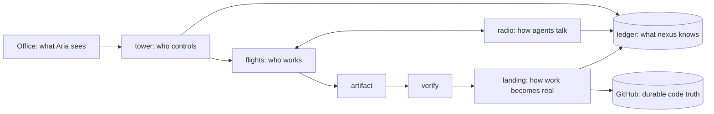

# The engine under the Office

🔧 ready to build. One line: the Office stays; the machinery beneath it (launchd, hcom, receipts,
board files, gates, pipeline, autopush, 76 hooks) is replaced by five primitives and one ledger.

Aria, 2026-09-03: "kill anything. restart nexus. no corruption, no lost durable work, no
ambiguous state." And: "reliability code gets a complexity budget too. nexus should become
smaller as its invariants improve."

## The primitives

| primitive | owns | never does |
|---|---|---|
| **tower** | scheduling, ownership leases, lifecycle, budgets, cancellation, retries, gates, health. One process; launchd only keeps it alive | do work; hold state outside the ledger |
| **ledger** | units, flights, state, artifacts, messages, receipts, events, gates. One sqlite file, versioned, append-only history | live in more than one place |
| **flights** | every unit of execution: claude, codex, antigravity, script, scheduled job. Isolated workspace, explicit objective, input, output, budget | touch a shared or human tree; decide its own success |
| **radio** | durable messages between flights and Aria. Delivered at the receiver's next turn, expire with the lease | decide presence, ownership, lifecycle, or success |
| **landing** | the only path from isolated work to shared state: verify, integrate, record. Atomic | happen without a verify record; half-apply |

Office is a projection of the ledger. GitHub is code truth. Ledger is operational truth. A
click in the Office becomes a ledger row that tower acts on.

## Every existing component maps to one primitive or dies

| today | becomes |
|---|---|
| 43 launchd plists, `jobrun`, `jobctl`, `registry.jsonl` | scheduled **flight plans** in the ledger; one plist keeps tower alive |
| hcom registrations, presence, kill, `hcom list` | **tower** (leases) |
| hcom messaging, `hcom send`, `hcom transcript` | **radio** |
| vault-git-lock, stash guard, autocorrect-bash, index.lock advice | gone: isolation makes them unreachable |
| vault-autopush, nexus clean's sweep, session branches, wip refs | **landing** |
| dispatch worktrees, leaked-worktree sweeper, `.worktrees/` | tower creates and destroys flight workspaces |
| session enrol hooks, `_meta/state/` registries, `ACTIVE.md` | automatic flight creation; ACTIVE is a ledger view |
| receipts jsonl, tool-error census, self-audit, `jobctl status`, wip-mirror census | **ledger** queries |
| board files, office bots, board-responder | ledger events; the feed is a view |
| webhook queue (loses dispatch after a 2xx on restart) | durable **events** in the ledger, acknowledged after commit |
| issue pipeline, care pipeline, lesson pipeline, release controller | flight plans plus product-specific verifiers |
| gates (`_meta/state/gates`, id-addressed, fail-closed) | tower interventions with the same ids and the same fail-closed rule |
| 76 hooks | only last-line safety boundaries: client default-branch push, secrets in tree, money. Everything else deleted with a test proving the class is unreachable |

A sixth primitive needs a written justification in this file. Nothing has one yet.

## Ledger schema v1

One file: `~/Library/Application Support/nexus/ledger.sqlite`, WAL mode, `PRAGMA user_version`
for migrations, copied to `ledger.sqlite.bak-<version>` before any migration.

| table | columns (key ones) | note |
|---|---|---|
| `plans` | id, name, kind (script, claude, codex, antigravity, lane), schedule (cron or event), objective, inputs json, outputs json, budget json (timeout_s, max_turns, max_cost, max_retries), paths json (lease set), enabled, quarantined_at | replaces registry.jsonl and pipeline scope |
| `flights` | id, plan_id, state (queued, leased, running, produced, verified, landed, failed, cancelled), lease_until, workspace, pid, started_at, ended_at, result json (structured, never free text), attempt | the unit of execution |
| `artifacts` | id, flight_id, kind (branch, file, receipt, screenshot), ref, sha, created_at | what a flight produced |
| `landings` | id, flight_id, target (repo, branch), verify_flight_id, state (pending, verified, applied, refused), applied_sha | atomic: state moves to applied in the same transaction as the record of the push |
| `messages` | id, from_flight, to_flight or to_operator, body, delivered_at, expires_at | radio |
| `gates` | id, flight_id, question, options json, answer, answered_by, answered_at, timeout_at | ids never reused; a stale answer is refused |
| `events` | id, ts, kind, subject, payload json, source (webhook, click, tower, flight) | append-only; every state change writes one |
| `leases` | path, flight_id, until | overlap refused at spawn |

Rules enforced in the ledger layer, not by callers: every write is a transaction that also
appends an `events` row; `flights.state` transitions follow a fixed table; a flight may not be
`landed` without a `landings` row in `applied`; history rows are never updated or deleted.

## Contracts

**Flight.** Input: plan row plus a fresh workspace (`git clone --shared` of the target repo under
`~/Library/Application Support/nexus/flights/<id>/`, or an empty dir for non-repo work).
Output: a `result` json `{ok, artifacts[], error{code, detail}, cost}` written by the runner, never
parsed from logs. Budget enforced by tower: timeout, turns, cost, retries. Workspace deleted after
landing or failure; artifacts survive in the ledger and on GitHub.

**Landing.** Verify flight runs the plan's verifier against the artifact (tests, parity, screenshot,
product gate); on pass tower pushes the branch, records `applied` with the sha in one transaction.
Retrying a landing is idempotent: same branch, same sha, no duplicate push, no duplicate post.
Human trees fast-forward only; tower never writes into a checkout a person uses.

**Radio.** `send(to, body)` durable before ack. Delivered at the receiver's next turn. Broadcast
does not exist. A message to a dead flight expires with its lease and is visible in the Office.

**Tower loop.** Every tick: expire leases, fail flights past budget, quarantine plans with N
consecutive failures, schedule due plans within a concurrency cap, launch queued flights detached,
reconcile narrowly (pid exists? branch exists? workspace exists?) and repair only that row. Killed
at any instruction, restart rebuilds from the ledger. Escape hatch: `nexus pause`, `nexus kill
<flight>`, `nexus hold-landing`, `nexus retry <flight>`, `nexus approve <gate>`.

## The laws

restartable · idempotent · leases not presence · durable before acknowledgement · atomic
transitions · bounded execution · backpressure · quarantine · degraded mode (GitHub down: flights
still produce; radio down: flights still work; verifier down: landing stops; Office down: tower
continues) · narrow reconciliation · versioned migrations with backup · append-only history ·
structured errors · escape hatch without ssh archaeology.

## crash-tower

`tests/crash_tower/`: real end-to-end flights with random faults injected: `kill -9` tower,
`kill -9` a flight, network off, push rejected, verifier hangs, disk full, malformed flight output,
duplicate tick, conflicting leases, kill during landing, kill during message delivery, machine
restart simulated by killing every process. After every run assert: ledger integrity check passes,
every artifact recorded exists, no flight is in a state with two valid readings. This suite is worth
more than every guard it replaces.

## Build order, each step leaves the machine runnable

| step | delivers | accepted when |
|---|---|---|
| 1 | `nexus/ledger.py`, schema v1, migrations, integrity check, event log | unit tests; crash-tower asserts on a synthetic run |
| 2 | `nexus/tower.py`: tick, leases, budgets, quarantine, script flights, one plist `com.nexus.tower` | a script plan runs on schedule; `kill -9` mid-flight, restart, flight failed with a structured error and rescheduled |
| 3 | landing for script flights (spool to branch to push), human trees fast-forward | CollabVault and Vaults scheduled output lands as commits without anyone touching the checkout |
| 4 | migrate the 43 plists into plans; delete `jobrun`, `jobctl`, `registry.jsonl`, plists | `launchctl list` shows one nexus job; every former job has a plan and a green or quarantined state |
| 5 | claude, codex, antigravity flights with isolated clones; gates as ledger rows | a lane flight produces a branch, a verifier flight verifies, landing applies |
| 6 | radio; Office reads the ledger for roster, desks, flows, gates; hcom removed | Office shows the same screens from one source |
| 7 | delete mapped components with a test per deletion; hooks down to the three boundaries | service line count and hook count both below half of today's |

Effort in agent wall-clock: 1 to 3 about 14 hours, 4 about 6, 5 about 12, 6 about 10, 7 about 8.
Two systems overlap only during step 4, one afternoon.
