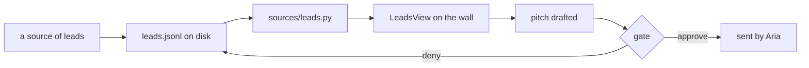

# The gig desk

🔧 ready to build (the board is built; the voice is not)

Turn the office from "four bots that describe the repo" into a crew whose
output is **consulting leads Aria can act on**. Nothing in the tweet is new
here. The parts that make it real are already built; what is missing is a
place for a lead to land and a source of leads to land in it.

## What already exists (do not rebuild)

| the thing the tweet sells | where it already is |
| --- | --- |
| one bot per responsibility | `_meta/bots.json`, four identities, one thread each |
| work continues after you close the laptop | `_meta/services/jobs/registry.jsonl` + the dispatch job |
| it asks before it acts | `client/runtime.py` gate + `Views/GateSheet.swift`, undismissable |
| a chief of staff that collapses five feeds into one update | `chief` bot, already the roster's first entry |
| spend does not run away | `sources/cost.py`, measured vs estimated kept apart |

## What is actually missing

Three files, following this repo's one-thing-one-file rule:

- `client/sources/leads.py` reads `<root>/_meta/leads/leads.jsonl`, returns its
  own `state` (`unconfigured` / `missing` / `ok`), never a bare count.
- `app/Office/Views/LeadsView.swift` draws it. A framing in `scripts/shoot.sh`.
- `tests/test_leads.py`.

A lead row: `id · found_at · where · who · what they need · rate signal ·
stage · last_touch · confidence`. Stages: `new → qualified → drafted → sent →
replied → dead`. `confidence` is a stated confidence, never a number pretending
to be a measurement.

## Roster change

`chief` stays. The other three become gig-shaped:

- **scout** finds leads and writes rows. Never judges, never writes prose.
- **qualify** turns a row into yes/no with a reason and a rate range.
- **pitch** drafts the message in her voice. **Never sends.** Sending crosses
  the gate, and the gate is the one thing this office has that a hosted bot
  does not.

One bot, one job, for the exact reason the reddit post gives: when something
goes wrong you know which desk to look at.

## The rules that carry over unchanged

- **A lead source is a budget, not a faucet.** Same doctrine as the GitHub
  5000/hour cap: one batched query per interval, last-good kept on disk, a
  failed fetch says "as of" instead of blanking the board.
- **No hand-maintained list.** Leads are rows in a ledger; dismissing one is an
  exception, not a second list.
- **Nothing goes out in her voice without the gate.** Not a draft email, not a
  DM, not a comment.

## Decided 2026-08-26

- **Nobody configures the lead source.** Scout rediscovers where Aria's work
  actually comes from and writes its finding to `_meta/leads/sources.json`.
  That file is a CLAIM: the board counts the receipts itself off the ledger and
  shows both, so a guess that never converts is visible as exactly that.
- **Draft, never send.** Pitch writes into the row's `draft` field and moves the
  lead to `drafted`, which by definition means waiting on Aria.
- **Scheduled once or twice a day**, through the existing jobs registry.
- **The voice comes first.** Pitch refuses to draft when
  `_meta/leads/voice.md` is missing or empty, and the board reports that
  absence as loudly as an empty ledger.

## Built

- `client/sources/leads.py`, registered in `client/sections.py`
- `tests/test_leads.py`, 21 tests
- `_meta/bots.json`: scout, qualify, pitch added beside chief

## Not built yet

- **The voice profile.** Needs samples of how Aria actually writes to people
  she wants to work with. Nothing should draft until it exists.
- **The wall.** The Mac app renders no `world.sections.*` at all today, for any
  of the six sources. The leads board would be the first section renderer, and
  that is a `Store.swift` + `RosterView.swift` change, which this repo's
  CLAUDE.md says to surface rather than do quietly.
- **The schedule.** A registry entry POSTing a scout turn, once the scout has
  somewhere real to look.
