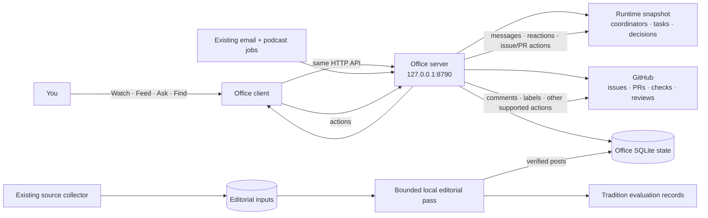
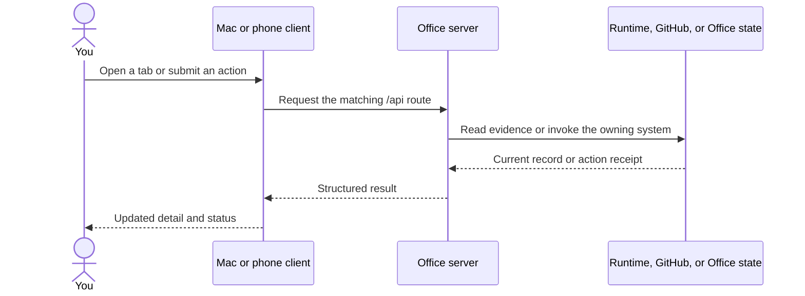

# Office, end to end

**A practical guide to the installed Mac and phone clients, their data, and the services behind them.**

Updated 23 September 2026. Office is the user interface for work and information already managed by the Vaults runtime. GitHub remains authoritative for issues and pull requests; the coordinator/runtime remains authoritative for execution and decisions; source records remain authoritative for feed stories. Office shows that evidence and gives you the relevant actions in one place.

## The product in one picture

The Mac app is a native wrapper around the shared Office client. The phone uses the same client as an installable web app. Their layout adapts to screen size, while the important content and actions come from the same backend and state.

## What each place is for

| Place | The question it answers | What you can do there |
|---|---|---|
| **Watch** | What needs my attention, and what are coordinators doing? | Review the decision queue one item at a time with Previous/Next, open the full list, inspect current coordinator activity and freshness, and follow direct links to the relevant task, issue, or PR. |
| **Feed** | What is worth knowing, seeing, or hearing? | Scroll short editorial posts; switch between For You, Latest, Following, and topic filters; open sources and media; play podcast moments; save, love, dislike, reply, and follow topics. The email digest archive remains available here too. |
| **Ask** | Can I ask Office to explain or direct work? | Continue one durable manager chat. Ask about status, evidence, issues, PRs, and timelines; route instructions; select Auto or an available Codex/Claude model. Rate answers Helpful or Missed so Auto can learn. |
| **Find** | Where is that conversation, document, task, run, or project? | Search across the connected Office objects and open the result in its native detail view. |

The tabs have different jobs: Watch is where a human decision is made, Feed is primarily for reading and reacting, Ask is the conversational control surface, and Find retrieves the underlying records. You should not need a terminal for routine supervision or direction. Ask is the short route when you know what you want but do not know which screen contains it.

### Watch and the decision queue

Decisions are prioritized above general activity. The default card is a revolving queue: Previous and Next change the visible decision without requiring a response to the current one. The full list is available when you want to scan everything. A coordinator’s status includes its latest meaningful evidence and whether that evidence is fresh; a queued instruction is not presented as completed work.

Use the issue or PR link on a work item to inspect its actual GitHub record. Office renders supported issue/PR details in the app and retains the direct GitHub link for the full native experience. A displayed status is an observation at a time, not a promise about later events.

### Feed and its content

Feed combines several kinds of objects rather than reducing everything to a digest:

- **Stories and curiosities** from outside sources, rendered as brief posts with publisher links and source evidence.
- **Images, galleries, and papers** when source media exists; the source remains linked.
- **Listen posts** that point to moments in the existing Office podcast audio. Office reuses the podcast pipeline and audio; it does not regenerate episodes for this feed pass.
- **Work updates** derived from current internal reports. These are clearly internal and can link to an issue or PR when the report supplies a matching URL.
- **Email digests** remain preserved and readable in the digest archive. Feed posts are an additional, bite-size view of selected external material, not a replacement for the source email.

Topics include world, politics, AI, science, history, business, culture, technology, work, and listen. For You uses your saved/loved/disliked reactions to gently tune category balance; Latest remains chronological, and Following emphasizes followed topics. Reactions, replies, follows, and saved state persist across the Mac and phone.

### Ask and model choice

Ask is one continuing conversation. Its default is the personal Codex session using `gpt-6-sol`. The model control can show currently available Codex and Claude Code choices, plus Auto; availability comes from the installed/authenticated clients rather than a permanently maintained list. Switching engines carries recent conversation context across so the chat stays coherent.

Auto uses a small Thompson-sampling policy over available candidates, informed by successful turns and Helpful/Missed ratings. Model selection is experimental and can change as evidence accumulates. Ask is a direct coding-agent session with the configured personal account and permissions; its manager instructions ask it to use current evidence, distinguish queued/read/acted/verified work, link source paths and GitHub records, and route substantial tasks through the existing coordinator/task system.

## How a screen becomes a real action

The API is grouped by the system that owns each capability: `/api/coordinators`, `/api/coordinator`, and `/api/tasks/*` for work supervision; `/api/github/*` for GitHub details and actions; `/api/feed*`, `/api/digests*`, and `/api/media*` for reading; `/api/ask*` for chat; `/api/search/*` for retrieval; and `/api/system/*` for job/run inspection. Writes such as `/api/feed/react`, `/api/feed/reply`, `/api/ask/send`, `/api/tasks/*`, and `/api/github/command` go through the same server door as reads.

## Feed generation: inputs to published post

The collector and the editorial model pass are separate. Existing source jobs refresh the private editorial input database; the Office feed job periodically refreshes it and runs a bounded editorial batch. The scheduled cycle is configured for hourly runs with a run-at-load pass. Each pass considers a limited number of candidates, uses one selected local model for that batch, then asks Ollama to unload it. Office does not keep Gemma or another editorial model resident between runs, and this pipeline has no cloud fallback.

The path is:

1. **Collect.** Existing source collection brings together publication feeds, news/newsletter material, and other configured external inputs. Existing email and podcast systems continue to run independently.
2. **Prepare.** Office reads recent source records, discards unusable/syndicated/marketing records, and brings in playable podcast entries and fresh internal reports. It groups likely duplicate/consequential world and politics coverage from different publishers.
3. **Choose a local editor.** Among installed, reachable candidates (`qwen2.5:7b-instruct`, `qwen2.5:3b`, `devstral:latest`), the runner samples a model using its published/failure feedback. It explores under-tested candidates first, then uses Thompson sampling. A missing local model is skipped; it does not silently call a hosted model.
4. **Draft.** The model writes a compact story, work update, or podcast moment using supplied source material. It cannot issue instructions through source text.
5. **Check evidence.** The runner checks source excerpts, factual overlap, numbers, independent publishers for paired consequential news, short length, and other basic constraints. Rejected or skipped candidates are recorded but not published. This is an evidence gate, not a claim of independent fact-checking.
6. **Publish and learn.** Accepted posts and their sources/media are stored in the Office feed database. The attempt is also recorded in the Tradition harness in a RunRecord-compatible form. Your save/love/dislike response tunes feed ranking; it does not alter the original source record.
7. **Release memory.** The runner sends an unload request for the selected Ollama model at the end of the bounded batch.

The editorial runner deliberately limits attention cost: a source entering the pipeline does not mean it will become a post. Existing podcast audio is linked and played through Office’s media pipeline; external posts keep their publisher links; internal work posts remain distinguished from external reporting.

### What the model experiment measures

The Tradition records let the local candidates be compared on real Office inputs and outcomes over time, including latency and published/rejected/skipped status. Your feedback gives a lightweight human quality signal. This is a practical ongoing experiment, not a claim that the current winner is universally best. The model set can be replaced based on measured results without changing the Office feed contract.

## State, privacy, and source of truth

Private Office state lives by default under `~/.local/state/nexus-office/` (the state root can be overridden with `OFFICE_STATE`). Key files include:

| State | Purpose |
|---|---|
| `office-feed.sqlite3` | Published posts, source metadata, reactions/replies/follows, model run and ranking feedback. |
| `office-ask.sqlite3` | One Ask transcript, current engine/model selection, thread/session identifiers, and answer ratings. |
| `editorial-refresh.json` | Last source-refresh receipt used to tell whether collection is fresh. |
| Tradition’s `tradition-office-editorial.jsonl` | Content-light local editorial evaluation records. |

The server is configured to bind to `127.0.0.1:8790`; the phone reaches it through the configured Tailscale Serve hostname and login. It is not intended to be exposed by binding the server to all network interfaces. The door also applies host/origin/content-type checks to writes. Private state directories/files use restricted permissions. Ask transcripts are user data; the local feed evaluation log is designed to record run metadata rather than article text.

Ownership boundaries matter. Office can present a coordinator’s observation, but the coordinator/runtime owns whether work ran. A GitHub issue/PR is authoritative for its title, comments, checks, and state. The source publisher/email/audio is authoritative for external information. A short feed post is an editorial presentation with links back to those records.

## Where the code is

| Area | Location |
|---|---|
| Shared web client and styling | `client/` (the app shell and responsive tab views) |
| HTTP server and route dispatch | `client/serve.py`, `client/office_api.py` |
| Feed data, interactions, and editorial runner | `client/office_feed.py`, `client/office_feed_runner.py` |
| Ask session and model bridge | `client/office_ask.py`, `client/office_profiles.py` |
| Podcast/email/search/GitHub/task integrations | `client/office_media.py`, `client/office_digests.py`, `client/office_search.py`, `client/office_github*.py`, `client/office_tasks.py` |
| Hourly source refresh + local feed run | `scripts/office-feed-cycle.sh` and its launchd registry entry `com.aria.office-feed` |
| Tradition evaluation integration | `the-tradition-harness` repository, `tradition_harness.models.office_editorial` |
| Product decision record and accepted prototype | `docs/design/office-build-brief-2026-09-23.md`, `docs/design/office-prototype/` |

## Opening and recovery

For normal use, open **Office.app** on the Mac. On the phone, open the configured Office Tailscale URL in Safari and add it to the Home Screen if desired. The phone path needs the device to be signed into the configured tailnet. Ask Office can answer operational questions such as what a coordinator last reported or whether the feed is fresh, using the evidence it can currently reach.

If Office cannot load, first check that the Mac is awake and online and that Tailscale is connected on the phone. The background server is `com.aria.office-serve`; the periodic editorial cycle is `com.aria.office-feed`. The Vaults command `vaults services status` shows registered services, and `vaults services restart <label>` restarts a service when needed. A stale feed may reflect stale input collection rather than a broken UI; check the feed job receipt and the editorial refresh timestamp. If local feed generation fails, check that an eligible Ollama model is installed and that the local Ollama endpoint is available. The runner records model failures and unloads after a completed pass.

## Verification and known boundaries

The delivered clients were exercised against real Office data. The web client was checked at desktop size and in a narrow phone-sized Safari viewport; Watch, Feed, and Ask were inspected at phone width. The Office test suite passed (138 tests), along with JavaScript syntax and Python compilation checks. A physical iPhone and its audio/lock-screen behavior were not part of that verification.

The Feed is a useful external-world reader, but it only knows sources configured in the existing collector and content successfully extracted from them. Source diversity and breaking-news latency therefore depend on collector inputs and schedules. The local editor can reject material and surface uncertainty, but a model-produced post is not a substitute for the linked source. Ask model choices depend on the Codex/Claude clients and accounts currently available on the Mac. The clients can direct and inspect supported work, while execution still belongs to the existing coordinators, task system, GitHub, and scheduled jobs.

## Related documents

- [Accepted Office prototype](design/office-prototype/)
- [Office build brief](design/office-build-brief-2026-09-23.md)
- [Office handoff](design/office-handoff-2026-09-23.md)
- [Desktop/mobile unification audit](desktop-mobile-unification-audit.md)
