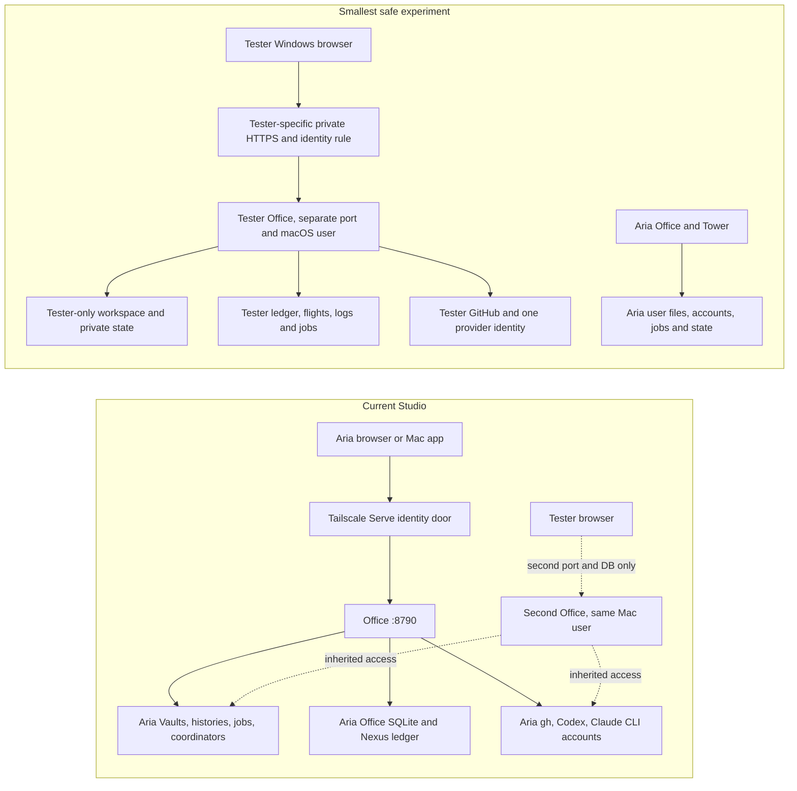

# Can a second person safely experience today's Nexus?

**Assessment date:** 2026-09-25  
**Scope:** One tester, one GitHub identity and workspace, Office in a Windows browser, Aria's Nexus continuing normally on the same Mac Studio. Research only; no service or configuration changes were made.

## Verdict

**The browser and the basic Nexus execution model can support the experiment, but a second Office process under Aria's current macOS account cannot safely isolate the tester.** A separate macOS user is the smallest credible security boundary. Even there, the current checkout needs a bounded extraction of Aria-specific account selection, discovery, sources, and service wiring before exposing the tester's Office. This is more than setting a second port and SQLite path, but substantially less than designing a cloud or multi-tenant Nexus.

The most important distinction is between *process scoping* and *security isolation*. Office state (`OFFICE_STATE`), Nexus ledger (`NEXUS_LEDGER`/`OFFICE_NEXUS_LEDGER`), flight directory (`NEXUS_FLIGHTS`), runtime root, and HTTP port can be selected separately. Yet the server also reads the process user's home, CLI histories, GitHub logins, hcom sessions, job receipts, coordinator files, and Vaults source paths. Its authenticated visitor can ask, search, browse, start code agents, and issue system and coordinator commands. A second process with the same Unix identity can still read and invoke Aria's things.

## Current and required boundaries

The required diagram assumes a dedicated macOS account with filesystem ownership and separate login/keychain context, a separately addressed Office service, and no shared mutable repository or work registry. Shared **code checkout, installed binaries, OS, and possibly a local model server** may be acceptable if treated as untrusted shared infrastructure and kept out of private data and account selection. Shared provider or GitHub authentication is not acceptable.

## Boundary inventory

| Surface | Current behavior | Experiment requirement |
| --- | --- | --- |
| Office HTTP | `client/serve.py` binds loopback; `OFFICE_PORT` or `--port` selects port. `OFFICE_TRUSTED_HOSTS` plus a single `OFFICE_LOGIN` gates remote requests. Loopback is implicitly trusted. No tenant identity exists within one Office process. | One service per macOS user and port; separate private tailnet hostname or other private HTTPS route and exact tester identity. Never proxy the tester to Aria's Office. |
| Office SQLite | Preferences, Ask, feed, search, uploads and other state derive from `OFFICE_STATE` (default `~/.local/state/nexus-office`). Some paths in `office-sync.py` independently use a fixed home-relative state directory. | Make every Office-owned path consistently instance/user scoped. A distinct macOS home helps, but audit the remaining absolute and derived paths. |
| Nexus ledger and flights | Ledger defaults to `~/Library/Application Support/nexus/ledger.sqlite`; `NEXUS_LEDGER` can override. Office uses `OFFICE_NEXUS_LEDGER`; Tower copies its selected ledger into child environments. Flight and retained log paths are separately derived or configurable. | Separate ledger, flights and logs, with one Tower consuming only that ledger and registry. Keep backups, receipts and recovery state separate. |
| Task runner | Office tasks enter a persistent ledger plan and run in disposable Git clones. The plan locates this checkout's `.venv` and starts `nexus.office_agent`; recovery and permissions are recorded in the ledger. | This path is reusable if the checkout, ledger, flight directory, workspace and CLI profile resolve wholly inside tester's account. Verify actual code and approval behavior. |
| Ask | `office_ask.py` stores turns in its own SQLite file and has a worker and recovery flow. It requires the `personal` Codex login for model listing, uses a personal Claude CLI seat, and may fall back between providers. Its working directory is the Office source checkout; its prompt names TBS and Matra. | Extract a tester provider seat and one-provider policy, suppress cross-provider fallback, give it only tester context, and ensure the Ask worker uses the tester state. |
| Feed | Feed database is Office-state scoped. The publisher is not: `office_feed_runner.py` derives Aria's Vaults from the source path, reads an editorial input DB and Tradition harness, calls Office at `127.0.0.1:8790`, and uses local Ollama models. | Omit the publisher initially. An empty feed is safe; generic work items would require a narrowed, tester-only publisher. Merely launching the current runner would risk Aria data entering tester feed. |
| Find / index | Search DB is Office-state scoped, but indexing walks discovered workspace roots, bot histories, media, ledger events, flight logs, job logs and optionally native transcripts. Search object details serve indexed text. | Restrict every source to tester-owned roots and records; do not assume a fresh index is safe if its source collectors can still reach Aria data. Exclude native/hcom histories until scoped. |
| Coordinators | `coordinators.json` explicitly lists TBS, Matra and Office, with paths derived relative to Aria's checkout; `/api/coordinator/say` can write inboxes, and messages are stamped `from: aria`. | Disable coordinator routes and cards or supply an empty, explicit tester roster. Do not point the tester at Aria's TBS/Matra services. Office task conversations suffice for the experiment. |
| Scheduler and machine jobs | One `com.nexus.tower` label is assumed by `nexus install`. The Studio also has many `com.aria.*` and `com.nexus.*` launchd jobs, plus a Vaults job registry. Job/system cards can observe that global machine state. | Distinct per-user launchd label and environment for tester Tower/Office/Ask worker; no registration in Aria's registry, no inherited TBS/Matra/personal plans. Hide or narrow machine-job controls and views. |
| Workspaces / GitHub | `OFFICE_RUNTIME_ROOT` bounds Office object roots, but discovery also adds `CollabVault`, `_meta` and task workspaces. `office-sync.py` enumerates `gh auth status` accounts and tries each token for access; `OFFICE_OWNERS` controls repo discovery, not credential isolation. Tower's work registry and several `gh` calls inherit process authentication. | Tester-only home, runtime root, checkout(s), `gh` config/token and one explicit repo allowlist. Prevent fallback to Aria's `gh` accounts. |
| Provider accounts | `office_profiles.py` defines only `personal` and `tbs` Claude/Codex seats, including `~/.codex-cli`, `~/.claude` and TBS config stores. `office_agent` falls back to the other engine. The autonomous issue executor calls Aria's `~/Developer/Vaults/_meta/services/tbs/account-router.sh`. | Add a tester seat/provider configuration. Remove Aria router dependency from the experiment's coding lane and restrict the engine to the tester-owned account. One owned provider can power the core workflow after these changes. |
| Local models | Ollama is a machine-level service; current feed publisher chooses fixed model names through Tradition harness and `localhost:11434`. | Not needed for Ask, Watch, Needs You or code work. Treat any shared Ollama use as shared compute with privacy concerns unless prompt/storage behavior is explicitly bounded. |
| Secrets and policy | Office wrapper fetches webhook and Buzz secrets from the current user's keychain. Workspace filters omit common secret files but do not form an OS security boundary. Codex tasks can run with broad filesystem access; Claude tools and provider policies vary. | Separate user, keychain, home and execution policy; no Aria secrets in tester environment. Review source-level allowlists and agent sandbox/approval policy before remote access. |
| Receipts / logs / events | Office aggregates ledger events, flight logs, job receipts, bot transcripts, native archives and hcom sessions. Several are under the shared user home or Vaults. | Tester-only source roots and process namespace; avoid global session/archive views and Aria events. Verify both directions by inspecting the actual UI and API results. |

## Windows browser and remote access

The Office page at `/` is ordinary HTML/CSS/JavaScript served by `client/serve.py`; it calls same-origin HTTP APIs. Watch, Needs You, Ask, projects, tasks, approvals, search, feed reading, GitHub desks and file views do not require the native Mac wrapper. The native bridge in `client/phone/office-native.js` is optional: it supplies Mac connection settings, haptics, and native audio transport. Browser audio has a fallback. A Windows browser loses those native touches, not the core workflow. The service worker and browser storage require a secure origin for full browser behavior; a private HTTPS tailnet URL is the intended shape.

The HTTP server binds only `127.0.0.1`, deliberately. Remote access therefore needs a reverse proxy such as Tailscale Serve. The code's remote door requires an allowed Host and `Tailscale-User-Login` equal to its configured login. The existing documentation describes Aria's tailnet route to port 8790, **not** a ready-made second-user route. The currently loaded `com.aria.office-serve` process was observed via `vaults services status`; I did not establish a live Tailscale mapping because the `tailscale` command was absent from this shell. Thus the code and prior documented route support Windows browser access in principle, but current second-host availability is unverified. Funnel/webhook exposure is unnecessary for this experiment; a private tailnet with a tester identity is the smaller path.

The main HTTP risk is that the identity check is per Office process, not per object or route. Any admitted tester can reach the process's files, search, histories, task powers and GitHub actions. The proxy must strip client-supplied identity headers and inject authenticated identity; `OFFICE_TRUSTED_HOSTS` alone is not authentication. Loopback is trusted automatically, so local processes in the same account can bypass the remote identity check.

## Inference and minimum useful workflow

**One tester-owned inference account can be enough for Ask plus Office task conversations and coding.** The current implementation does *not* expose a simple “set one provider API key” mode. Ask and tasks speak to installed Codex or Claude CLI transports and use configured login stores. Ask currently requires the personal Codex seat even to list models, and its recovery/fallback can select the other provider. Office tasks do the same cross-engine fallback. The separate autonomous GitHub issue lane is more tightly coupled to Aria's TBS account router and review policy. Therefore one API key by itself is **not sufficient with current configuration**; a small provider-seat and fallback extraction is required, and the chosen CLI must demonstrably authenticate solely as the tester. No Aria subscription or login should be reused.

The tester could then receive:

1. **Ask**, scoped to the tester's workspace, ledger and GitHub context.
2. **Watch / Needs You**, from one repo's GitHub activity, Office tasks, approval requests, and tester Tower runs.
3. **Autonomous coding work** through Office task conversations and the isolated Tower, including its flight receipts and recovery. The full issue conveyor needs extra extraction of the Aria account router and TBS-specific policy before it is safe.
4. **Find**, once its collectors are restricted to tester roots. Browser file browsing and GitHub detail work with the same boundary.
5. **Feed reading** with an empty or tester-only store; current editorial publication is excluded.

The tester would not receive TBS or Matra coordinators, Aria's bot/live hcom conversations, personal email/calendar/news/finance/podcasts, local Mac app features, shared native transcript archives, or the current editorial feed runner. Missing optional source files generally yield an unconfigured or empty card through `sections.py`, but that graceful rendering is **not proof of privacy**: other collectors still traverse global paths, and hardcoded coordinator and feed sources must be explicitly disabled or scoped.

## Smallest changes before a safe full experiment

1. **Use a distinct macOS user** with private home/keychain, tester-only checkout and runtime root. Keep Aria's service and Unix identity as they are. A second process under Aria's account does not meet the guarantee.
2. **Make Office's instance boundary complete:** state, access cache, receipts, ledger, flights, logs, uploads, search, archive collectors, hcom/session views and all API routes must resolve within tester-owned roots. Explicitly omit Aria source modules, coordinator roster and machine-wide controls for this profile.
3. **Create a tester-only auth lane:** one GitHub account and repo allowlist, one CLI provider seat, no inherited credentials, no automatic fallback to Aria's other engine, and no TBS account router in the coding path.
4. **Start independent lifecycle services:** a uniquely named Office, Ask worker and Tower under the tester login with distinct port, paths and launchd labels. Register no Aria jobs or plans. Give the tester a private HTTPS tailnet route and exact identity rule.
5. **Prove isolation on the real surfaces before inviting the tester:** inspect browser/API search, archives, feed, coordinators, machine pages, workspace list, task environment, GitHub actions, provider identity and flight logs; verify Aria's side cannot see tester data either. Test one bounded coding task and its permission/recovery receipt.

This is **configuration plus focused extraction**, not a new deployment architecture, if the experiment uses separate OS accounts and a narrow feature set. It is not a zero-code configuration exercise. Trying to keep both instances inside one macOS account would require a much broader sandbox, credential broker and route-level authorization design; that would be the wrong size for this test.

## Even smaller product-hypothesis test

If the immediate hypothesis is “can a second person use Office to supervise one repo from Windows?”, the smallest safe test is a **read-limited, tester-only Office slice** under a separate macOS user: one repo, private browser route, GitHub watch, Needs You display, and Ask using the tester's provider identity. Keep autonomous execution disabled until the account and filesystem boundary is proved. This tests the browser experience and information architecture with less code and lower blast radius. It does **not** prove the full autonomous coding hypothesis; add one isolated Office task and Tower only after the first boundary proof.

## Evidence and limits

Primary source anchors: [HTTP door](../client/serve.py), [Office routes](../client/office_api.py), [Office sync and GitHub access](../client/office-sync.py), [workspace roots](../client/office_objects.py), [search collectors](../client/office_search.py), [Nexus ledger](../nexus/ledger.py), [Tower](../nexus/tower.py), [Office task plan](../nexus/office_tasks.py), [provider profiles](../client/office_profiles.py), [Ask](../client/office_ask.py), [agent fallback](../nexus/office_agent.py), [issue executor](../nexus/executor.py), [feed publisher](../client/office_feed_runner.py), [coordinator roster](../client/coordinators.json), and [documented tailnet access](../README.md).

This assessment is from source and read-only service inspection. The checkout had pre-existing uncommitted edits and was behind its upstream branch during inspection, so source may differ from Aria's running 8790 process. I did not send a remote browser request or run a tester task. Those live proofs belong to the proposed experiment, after the boundary work.
