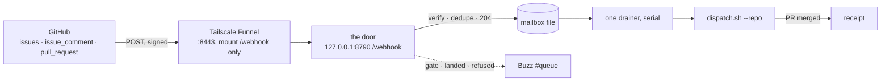

# Webhooks: the office finds out at once

Until now the office learned about GitHub by asking, every five minutes. A
webhook means GitHub tells it, in about a second. Same door, same machine, one
new public path and nothing else.

## The picture



Read it in that order, because each arrow is a rule:

- **One port, one path.** Funnel is per port, not per path, so it gets its own
  port with exactly one mount. Port 8443 serves `/webhook` and 404s everything
  else. Port 443 stays Serve, tailnet only, the phone's door.
- **Answer first, work after.** GitHub gives you 10 seconds and then calls the
  delivery failed. So the door verifies the signature, writes the event to a
  mailbox file, returns 204, and lets a drainer do the work.
- **One drainer, serial.** `dispatch.sh` holds a single global lock and exits 0
  when it is already held. Spawning one per event would silently drop every
  event but the first, so events queue in a file and one thread runs them one at
  a time.
- **The webhook triggers, dispatch decides.** The event says "look at this repo".
  What to do about it is still `dispatch.sh`'s call, exactly as it is on the poll.
- **Buzz is the tap on the shoulder.** A raised gate, a landed PR, a refused
  lane. Throttled per kind and subject, so a redelivery storm is one message.

## The two keychain items

Neither ever lands in a file, a log, or a commit. `_meta/services/office/office`
reads both and exports them; the client itself holds nothing.

| item | what it is | missing means |
| --- | --- | --- |
| `nexus-office` / `webhook-secret` | the HMAC GitHub signs each delivery with | `/webhook` answers 503, the rest of the office is fine |
| `buzz-tbs-hook-gh-board` / `webhook-secret` | the Buzz workflow hook into `#queue` | no taps on the shoulder, said once in the log |

`scripts/register-webhooks.sh` creates the first one on its first real run and
hands the same value to GitHub. The second already exists and is shared with
`thinking-brain-school/buzz`.

## Status, 2026-08-27: nothing has ever arrived, and here is why

Both halves below are still undone, and neither of them failed. They were never
run. Measured on this machine on 2026-08-27:

| thing | state | how it was checked |
| --- | --- | --- |
| the secret | present | keychain `nexus-office/webhook-secret`, and it is byte-identical to the `OFFICE_WEBHOOK_SECRET` the running door holds |
| the door | healthy | `POST /webhook` unsigned answers 403, which is the correct refusal |
| Funnel | **absent** | `tailscale funnel status` says `No serve config` |
| Serve on the tailnet | **not enabled at all** | `tailscale serve --bg --https=443` answers "Serve is not enabled on your tailnet" with an admin-console link |
| the hooks | **none, on any repo** | `gh api repos/<nwo>/hooks` returns an empty list for every repo checked |
| deliveries | zero, ever | `~/.local/state/nexus-office/` holds no `webhook-seen.json`, no events file and no runs file |

So the office was not wrong to be quiet. There was no path for anything to
arrive on, and nothing sending. **Step 1 below is the blocker**, and it is the
one thing on this page no agent and no script on this machine can do: enabling
Serve and Funnel is a change to the tailnet's own policy, made while signed in
to the Tailscale admin console as the tailnet owner.

The office no longer hides this. When nothing has ever arrived it asks Tailscale
whether there is a public mount at all, and a door with no Funnel in front of it
reports `unreachable` with the reason written on the Webhooks card and on the
automation page, instead of `silent`, which is what a quiet Sunday looks like.

## Status, 2026-08-27 later the same day: the hooks exist, the path still does not resolve

Serve and Funnel were enabled on the tailnet, the mount went up, and 28 hooks
were registered. GitHub still cannot reach the door, and the reason is one line:

```sh
dig +short @1.1.1.1 this-mac.tailnet.ts.net    # -> nothing. No A, no AAAA.
```

**The public DNS record for the Funnel host is not published.** From this Mac the
name resolves to `100.87.127.43` through MagicDNS, which is why a `curl` from
here answers 403 and proves nothing: it never left the tailnet. That is the trap
this whole file exists to name, walked into once more. The authoritative caller
is GitHub, and every one of the 28 hooks records the same thing:

```
connection_error 502 failed to connect to host
```

`tailscale funnel status` says `Funnel on` and the node holds both the `funnel`
and the `https` capability, with `funnel-ports?ports=443,8443,10000`. So the
mount is real and the tailnet allows it; what is missing is the record that
lets the outside world find it, and Tailscale publishes that only once the
node's HTTPS certificate has actually been provisioned.

**The one thing left, and it must be run by Aria in a normal terminal**, because
an agent sandbox cannot write the certificate files:

```sh
/Applications/Tailscale.app/Contents/MacOS/Tailscale cert this-mac.tailnet.ts.net
dig +short @1.1.1.1 this-mac.tailnet.ts.net    # should answer now
```

Then redeliver any hook's ping from GitHub, or:

```sh
gh api -X POST repos/ariaxhan/nexus-office/hooks/671237896/pings
gh api repos/ariaxhan/nexus-office/hooks/671237896 --jq .last_response
```

A green ping means the whole path works. Until then the 28 hooks sit there
failing; GitHub disables a hook only after repeated failures over days, so there
is no rush and nothing to undo.

**The office cannot see this failure, and here is the honest limit.** `reach()`
asks the local daemon whether a mount exists, which is a fact about this machine
and never a claim that the internet can reach it. That is stated in its
docstring and it is why the Webhooks card now reads `silent` rather than
`unreachable`: from in here, a mounted door with nothing arriving and a working
door on a quiet Sunday are the same picture. The thing that would tell them
apart is GitHub's own `last_response`, which costs a REST call per repo and is
not worth putting on a snapshot push.

## What Aria has to click

Two things, and only these two.

**1. Turn Funnel on for the tailnet.** In the admin console, Access Controls,
expand the Funnel section and select **Add Funnel to policy**. That writes
`"nodeAttrs": [{"target": ["autogroup:member"], "attr": ["funnel"]}]`. Without
it the command below refuses.

**2. Run one command.** Serve on 443 is already up and is not touched.

```sh
/Applications/Tailscale.app/Contents/MacOS/Tailscale funnel --bg --https=8443 --set-path=/webhook http://127.0.0.1:8790/webhook
```

Then check it took, and warm the certificate before GitHub is the first caller:

```sh
/Applications/Tailscale.app/Contents/MacOS/Tailscale funnel status   # AllowFunnel on :8443, nothing else
curl -sS -o /dev/null -w '%{http_code}\n' https://this-mac.tailnet.ts.net:8443/webhook
```

Certificates are provisioned lazily on the first connection, so the first call
can time out. That is what this curl is for. "Funnel on" is not proof it works.

## Registering the hooks

One hook per repo: GitHub has no user-level webhooks. The repo list is read from
the office door, so it is exactly the desks the office already polls, and nobody
maintains a list.

```sh
cd CodingVault/nexus-office
scripts/register-webhooks.sh --dry-run https://this-mac.tailnet.ts.net:8443/webhook
scripts/register-webhooks.sh           https://this-mac.tailnet.ts.net:8443/webhook
```

It prints one line per desk: `created`, `updated`, `unchanged`, or
`skipped: <why>`. Run it as often as you like; a desk that is already right says
`unchanged` and costs one read. `--repo owner/name` does a single desk.

Today's dry run: 34 desks, 28 to create, 6 skipped because no account here has
admin on them.

One thing it deliberately cannot do: **rotate the secret.** GitHub never gives a
hook's secret back, so the script compares events and the active flag and leaves
the secret alone. To rotate, delete the hooks and re-run.

## How to tell it works

Three checks, cheapest first.

1. **The door.** `curl -s 127.0.0.1:8790/api/webhook` says whether the secret is
   configured, what has arrived, and what the last delivery did.
2. **The office.** The Webhooks card in the app shows the same thing without a
   terminal.
3. **GitHub.** The repo's Settings, Webhooks, **Recent Deliveries**. A green
   check on the `ping` means the whole path works: Funnel resolved, the
   certificate is real, the signature verified, the door answered 2xx in time. A
   red one shows the request and the response, which is usually the whole answer.

`ping` gets a 204 and nothing else happens. It is a confirmation from GitHub that
the hook is configured, not an event to act on.

If deliveries are red and the door log is silent, the request never arrived: that
is Funnel or the certificate, not the office. If the door logs a rejection, the
signature did not match, which means the keychain item and the hook were created
at different times.
